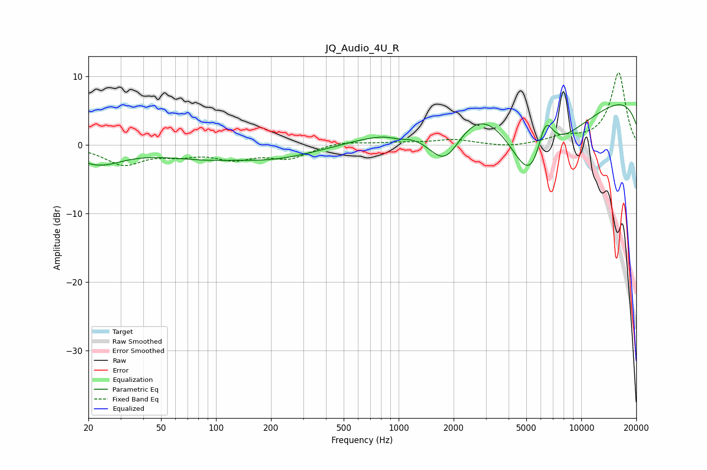

# JQ_Audio_4U_R
See [usage instructions](https://github.com/jaakkopasanen/AutoEq#usage) for more options and info.

### Parametric EQs
Apply preamp of -6.0 dB when using parametric equalizer.

|   # | Type    |   Fc (Hz) |    Q |   Gain (dB) |
|-----|---------|-----------|------|-------------|
|   1 | Peaking |        23 | 1.08 |        -2.6 |
|   2 | Peaking |       131 | 0.85 |         1   |
|   3 | Peaking |       134 | 0.45 |        -2.8 |
|   4 | Peaking |       195 | 0.38 |        -0.5 |
|   5 | Peaking |      1009 | 2.81 |        -0.6 |
|   6 | Peaking |      1799 | 1.21 |        -9.3 |
|   7 | Peaking |      2600 | 0.47 |        11.3 |
|   8 | Peaking |      5364 | 0.67 |       -20   |
|   9 | Peaking |      6348 | 2.83 |         6.8 |
|  10 | Peaking |     10000 | 0.18 |         9.3 |

### Fixed Band EQs
When using fixed band (also called graphic) equalizer, apply preamp of **-10.6 dB** (if available) and set gains manually with these parameters.

|   # | Type    |   Fc (Hz) |    Q |   Gain (dB) |
|-----|---------|-----------|------|-------------|
|   1 | Peaking |        31 | 1.41 |        -2.7 |
|   2 | Peaking |        62 | 1.41 |        -1.1 |
|   3 | Peaking |       125 | 1.41 |        -1.8 |
|   4 | Peaking |       250 | 1.41 |        -1.8 |
|   5 | Peaking |       500 | 1.41 |         0.6 |
|   6 | Peaking |      1000 | 1.41 |         0.3 |
|   7 | Peaking |      2000 | 1.41 |         0.8 |
|   8 | Peaking |      4000 | 1.41 |        -0.4 |
|   9 | Peaking |      8000 | 1.41 |         1   |
|  10 | Peaking |     16000 | 1.41 |        10.6 |

### Graphs

