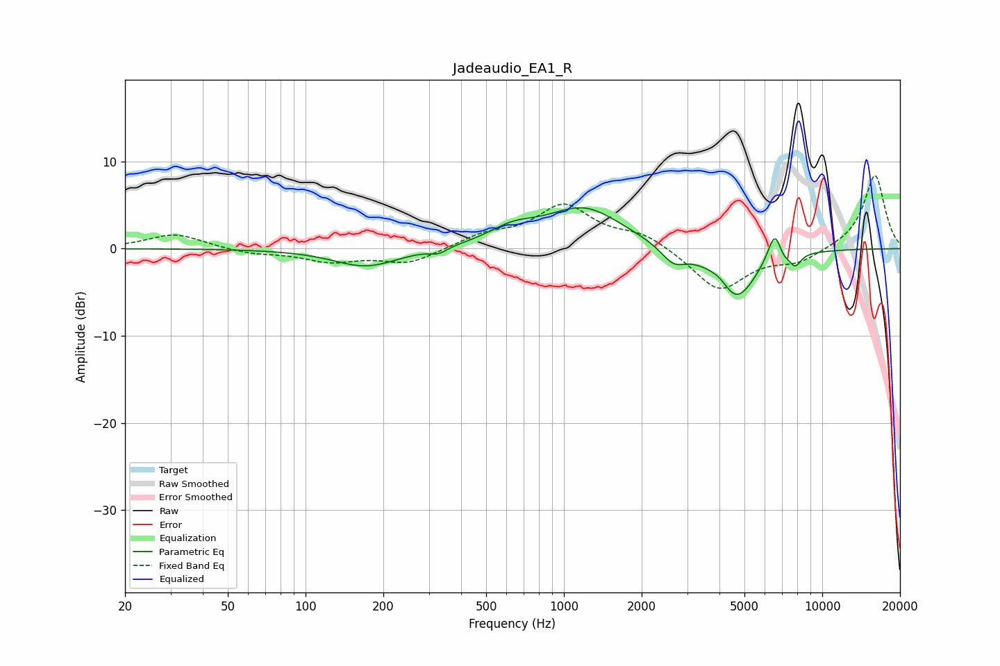

# Jadeaudio_EA1_R
See [usage instructions](https://github.com/jaakkopasanen/AutoEq#usage) for more options and info.

### Parametric EQs
Apply preamp of -4.8 dB when using parametric equalizer.

|   # | Type    |   Fc (Hz) |    Q |   Gain (dB) |
|-----|---------|-----------|------|-------------|
|   1 | Peaking |       171 | 1.13 |        -2.1 |
|   2 | Peaking |       327 | 4.33 |        -0.6 |
|   3 | Peaking |       631 | 1.52 |         1.6 |
|   4 | Peaking |      1197 | 0.95 |         4.6 |
|   5 | Peaking |      2657 | 2.91 |        -1.9 |
|   6 | Peaking |      4036 | 3.45 |         1   |
|   7 | Peaking |      4621 | 1.76 |        -6.1 |
|   8 | Peaking |      6566 | 4.83 |         3.8 |
|   9 | Peaking |      7022 | 5.97 |        -1   |
|  10 | Peaking |      7858 | 5.99 |        -1.5 |

### Fixed Band EQs
When using fixed band (also called graphic) equalizer, apply preamp of **-8.5 dB** (if available) and set gains manually with these parameters.

|   # | Type    |   Fc (Hz) |    Q |   Gain (dB) |
|-----|---------|-----------|------|-------------|
|   1 | Peaking |        31 | 1.41 |         1.7 |
|   2 | Peaking |        62 | 1.41 |        -0.6 |
|   3 | Peaking |       125 | 1.41 |        -1.4 |
|   4 | Peaking |       250 | 1.41 |        -1.7 |
|   5 | Peaking |       500 | 1.41 |         1.4 |
|   6 | Peaking |      1000 | 1.41 |         4.8 |
|   7 | Peaking |      2000 | 1.41 |         1.6 |
|   8 | Peaking |      4000 | 1.41 |        -4.9 |
|   9 | Peaking |      8000 | 1.41 |        -1.4 |
|  10 | Peaking |     16000 | 1.41 |         8.5 |

### Graphs

