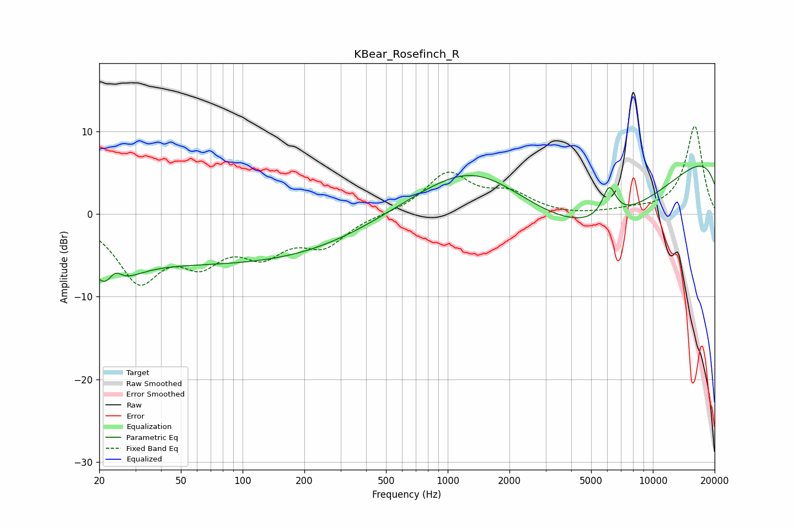

# KBear_Rosefinch_R
See [usage instructions](https://github.com/jaakkopasanen/AutoEq#usage) for more options and info.

### Parametric EQs
Apply preamp of -5.9 dB when using parametric equalizer.

|   # | Type    |   Fc (Hz) |    Q |   Gain (dB) |
|-----|---------|-----------|------|-------------|
|   1 | Peaking |        22 | 2.17 |        -3.8 |
|   2 | Peaking |        23 | 3.13 |        -0.3 |
|   3 | Peaking |        23 | 4.23 |         0.8 |
|   4 | Peaking |        24 | 1.07 |        -2.2 |
|   5 | Peaking |        24 | 3.87 |         2.3 |
|   6 | Peaking |        86 | 0.18 |        -5.9 |
|   7 | Peaking |      1344 | 0.44 |        10.1 |
|   8 | Peaking |      4621 | 0.25 |       -14.5 |
|   9 | Peaking |      6128 | 4.05 |         3.7 |
|  10 | Peaking |     10000 | 0.18 |        12.2 |

### Fixed Band EQs
When using fixed band (also called graphic) equalizer, apply preamp of **-10.7 dB** (if available) and set gains manually with these parameters.

|   # | Type    |   Fc (Hz) |    Q |   Gain (dB) |
|-----|---------|-----------|------|-------------|
|   1 | Peaking |        31 | 1.41 |        -7.6 |
|   2 | Peaking |        62 | 1.41 |        -4.6 |
|   3 | Peaking |       125 | 1.41 |        -4   |
|   4 | Peaking |       250 | 1.41 |        -3.4 |
|   5 | Peaking |       500 | 1.41 |        -0   |
|   6 | Peaking |      1000 | 1.41 |         4.8 |
|   7 | Peaking |      2000 | 1.41 |         2.2 |
|   8 | Peaking |      4000 | 1.41 |        -0.2 |
|   9 | Peaking |      8000 | 1.41 |         0.4 |
|  10 | Peaking |     16000 | 1.41 |        10.7 |

### Graphs

