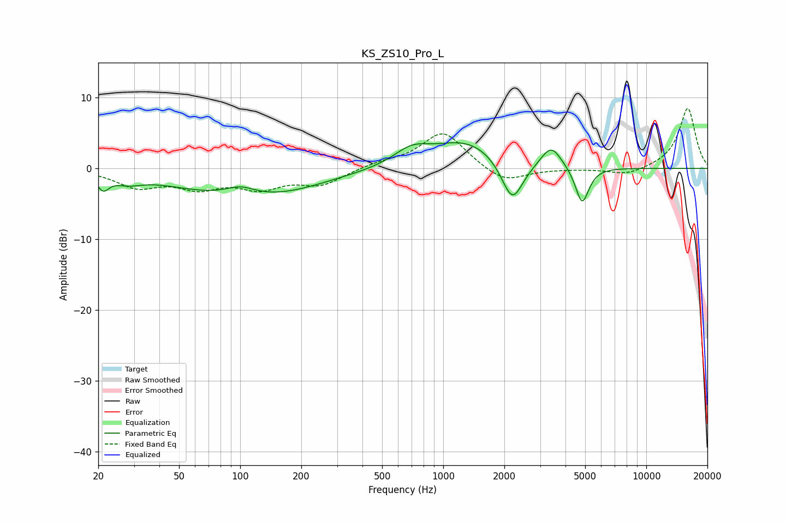

# KS_ZS10_Pro_L
See [usage instructions](https://github.com/jaakkopasanen/AutoEq#usage) for more options and info.

### Parametric EQs
Apply preamp of -3.7 dB when using parametric equalizer.

|   # | Type    |   Fc (Hz) |    Q |   Gain (dB) |
|-----|---------|-----------|------|-------------|
|   1 | Peaking |        21 | 4.94 |        -2   |
|   2 | Peaking |        28 | 2.04 |        -1.1 |
|   3 | Peaking |        81 | 0.49 |        -2.7 |
|   4 | Peaking |       100 | 1.82 |         1.5 |
|   5 | Peaking |       160 | 0.56 |        -2   |
|   6 | Peaking |       699 | 1.62 |         2.1 |
|   7 | Peaking |      1311 | 0.83 |         3.9 |
|   8 | Peaking |      2188 | 2.61 |        -6.2 |
|   9 | Peaking |      3401 | 2.83 |         3.1 |
|  10 | Peaking |      4831 | 4.23 |        -5.3 |

### Fixed Band EQs
When using fixed band (also called graphic) equalizer, apply preamp of **-8.6 dB** (if available) and set gains manually with these parameters.

|   # | Type    |   Fc (Hz) |    Q |   Gain (dB) |
|-----|---------|-----------|------|-------------|
|   1 | Peaking |        31 | 1.41 |        -2.4 |
|   2 | Peaking |        62 | 1.41 |        -2.4 |
|   3 | Peaking |       125 | 1.41 |        -2.4 |
|   4 | Peaking |       250 | 1.41 |        -2.2 |
|   5 | Peaking |       500 | 1.41 |         0.7 |
|   6 | Peaking |      1000 | 1.41 |         5.2 |
|   7 | Peaking |      2000 | 1.41 |        -2.2 |
|   8 | Peaking |      4000 | 1.41 |        -0   |
|   9 | Peaking |      8000 | 1.41 |        -1   |
|  10 | Peaking |     16000 | 1.41 |         8.6 |

### Graphs

