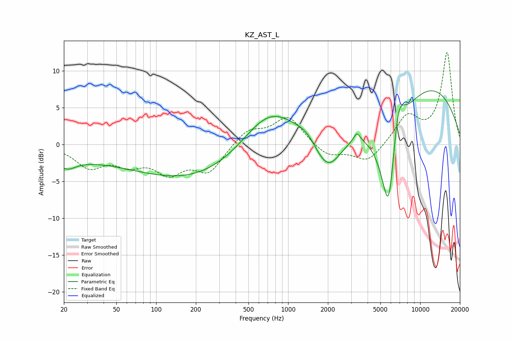

# KZ_AST_L
See [usage instructions](https://github.com/jaakkopasanen/AutoEq#usage) for more options and info.

### Parametric EQs
Apply preamp of -7.4 dB when using parametric equalizer.

|   # | Type    |   Fc (Hz) |    Q |   Gain (dB) |
|-----|---------|-----------|------|-------------|
|   1 | Peaking |        21 | 2.18 |        -1.3 |
|   2 | Peaking |        22 | 0.21 |        -1.7 |
|   3 | Peaking |       270 | 0.29 |        -5.1 |
|   4 | Peaking |       716 | 0.62 |         7.3 |
|   5 | Peaking |      1397 | 1.82 |         1.1 |
|   6 | Peaking |      1996 | 1.22 |        -6.1 |
|   7 | Peaking |      3316 | 6    |         1.2 |
|   8 | Peaking |      5791 | 1.8  |       -18.1 |
|   9 | Peaking |      6798 | 2.75 |         7.1 |
|  10 | Peaking |      9201 | 0.28 |         9.3 |

### Fixed Band EQs
When using fixed band (also called graphic) equalizer, apply preamp of **-12.6 dB** (if available) and set gains manually with these parameters.

|   # | Type    |   Fc (Hz) |    Q |   Gain (dB) |
|-----|---------|-----------|------|-------------|
|   1 | Peaking |        31 | 1.41 |        -2.8 |
|   2 | Peaking |        62 | 1.41 |        -2.2 |
|   3 | Peaking |       125 | 1.41 |        -3.4 |
|   4 | Peaking |       250 | 1.41 |        -3.5 |
|   5 | Peaking |       500 | 1.41 |         2   |
|   6 | Peaking |      1000 | 1.41 |         3.8 |
|   7 | Peaking |      2000 | 1.41 |        -1.7 |
|   8 | Peaking |      4000 | 1.41 |        -2.5 |
|   9 | Peaking |      8000 | 1.41 |         3.7 |
|  10 | Peaking |     16000 | 1.41 |        12.4 |

### Graphs

