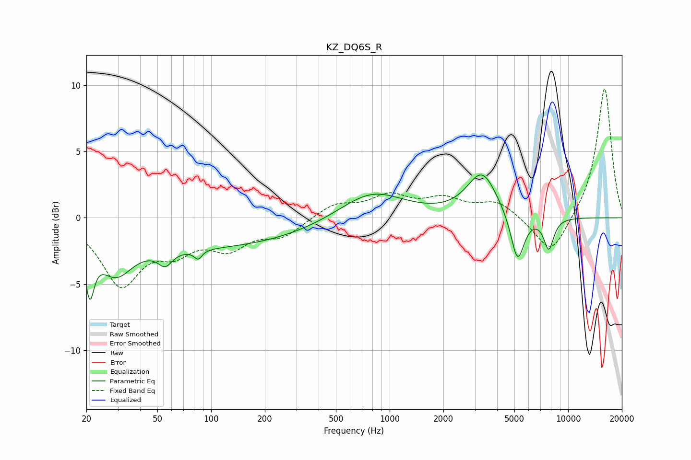

# KZ_DQ6S_R
See [usage instructions](https://github.com/jaakkopasanen/AutoEq#usage) for more options and info.

### Parametric EQs
Apply preamp of -3.3 dB when using parametric equalizer.

|   # | Type    |   Fc (Hz) |    Q |   Gain (dB) |
|-----|---------|-----------|------|-------------|
|   1 | Peaking |        21 | 5.86 |        -3.7 |
|   2 | Peaking |        29 | 1.52 |        -2.8 |
|   3 | Peaking |        55 | 3.58 |        -1.1 |
|   4 | Peaking |        86 | 5.96 |        -2.9 |
|   5 | Peaking |        86 | 5.97 |         2.2 |
|   6 | Peaking |        95 | 0.24 |        -2.2 |
|   7 | Peaking |       792 | 0.79 |         2.1 |
|   8 | Peaking |      3292 | 1.69 |         3.3 |
|   9 | Peaking |      5204 | 3.67 |        -3.7 |
|  10 | Peaking |      7788 | 4.71 |        -2.4 |

### Fixed Band EQs
When using fixed band (also called graphic) equalizer, apply preamp of **-9.8 dB** (if available) and set gains manually with these parameters.

|   # | Type    |   Fc (Hz) |    Q |   Gain (dB) |
|-----|---------|-----------|------|-------------|
|   1 | Peaking |        31 | 1.41 |        -4.8 |
|   2 | Peaking |        62 | 1.41 |        -2   |
|   3 | Peaking |       125 | 1.41 |        -2   |
|   4 | Peaking |       250 | 1.41 |        -1.3 |
|   5 | Peaking |       500 | 1.41 |         1   |
|   6 | Peaking |      1000 | 1.41 |         1.5 |
|   7 | Peaking |      2000 | 1.41 |         1.2 |
|   8 | Peaking |      4000 | 1.41 |         1.2 |
|   9 | Peaking |      8000 | 1.41 |        -2.9 |
|  10 | Peaking |     16000 | 1.41 |         9.9 |

### Graphs

