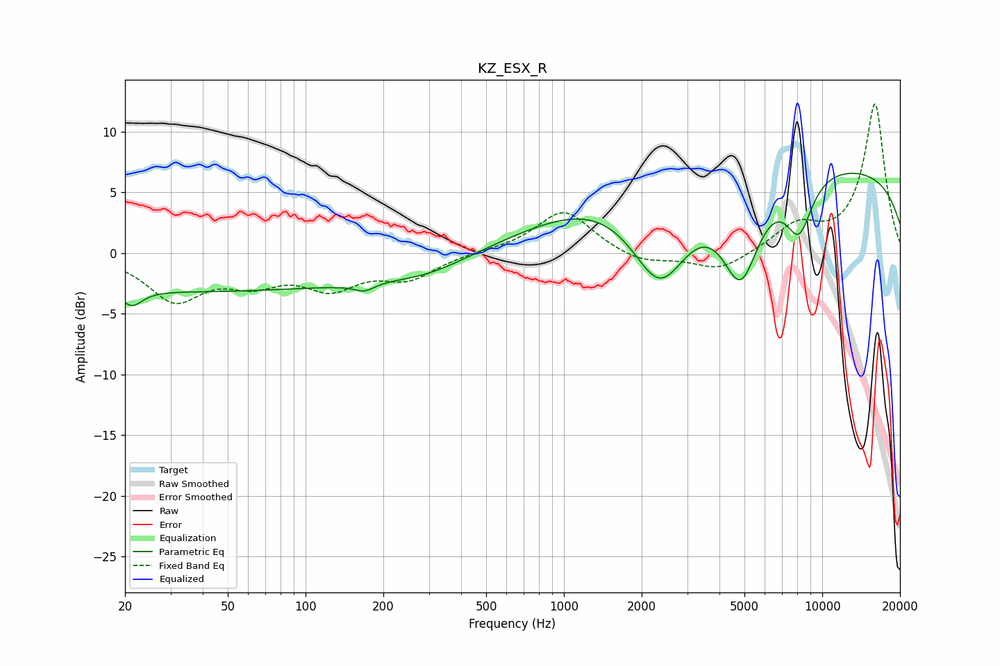

# KZ_ESX_R
See [usage instructions](https://github.com/jaakkopasanen/AutoEq#usage) for more options and info.

### Parametric EQs
Apply preamp of -6.7 dB when using parametric equalizer.

|   # | Type    |   Fc (Hz) |    Q |   Gain (dB) |
|-----|---------|-----------|------|-------------|
|   1 | Peaking |        21 | 3.55 |        -1.4 |
|   2 | Peaking |        38 | 0.18 |        -3.1 |
|   3 | Peaking |       142 | 1.3  |        -0.2 |
|   4 | Peaking |       169 | 3.63 |        -0.6 |
|   5 | Peaking |       296 | 0.82 |        -1.2 |
|   6 | Peaking |      2080 | 0.42 |         6.9 |
|   7 | Peaking |      2358 | 0.97 |       -11.8 |
|   8 | Peaking |      4833 | 1.79 |        -8.4 |
|   9 | Peaking |      8128 | 2.47 |        -4.6 |
|  10 | Peaking |      9894 | 0.18 |         7.1 |

### Fixed Band EQs
When using fixed band (also called graphic) equalizer, apply preamp of **-12.4 dB** (if available) and set gains manually with these parameters.

|   # | Type    |   Fc (Hz) |    Q |   Gain (dB) |
|-----|---------|-----------|------|-------------|
|   1 | Peaking |        31 | 1.41 |        -3.7 |
|   2 | Peaking |        62 | 1.41 |        -1.9 |
|   3 | Peaking |       125 | 1.41 |        -2.5 |
|   4 | Peaking |       250 | 1.41 |        -1.9 |
|   5 | Peaking |       500 | 1.41 |         0.1 |
|   6 | Peaking |      1000 | 1.41 |         3.6 |
|   7 | Peaking |      2000 | 1.41 |        -0.9 |
|   8 | Peaking |      4000 | 1.41 |        -1.5 |
|   9 | Peaking |      8000 | 1.41 |         2.1 |
|  10 | Peaking |     16000 | 1.41 |        12.3 |

### Graphs

