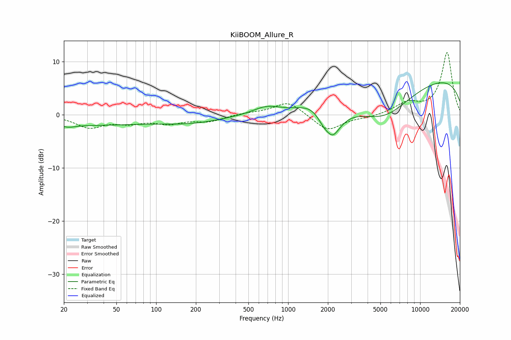

# KiiBOOM_Allure_R
See [usage instructions](https://github.com/jaakkopasanen/AutoEq#usage) for more options and info.

### Parametric EQs
Apply preamp of -6.1 dB when using parametric equalizer.

|   # | Type    |   Fc (Hz) |    Q |   Gain (dB) |
|-----|---------|-----------|------|-------------|
|   1 | Peaking |        22 | 3.2  |        -0.4 |
|   2 | Peaking |        26 | 0.26 |        -1.9 |
|   3 | Peaking |       118 | 2.01 |        -0   |
|   4 | Peaking |       193 | 0.59 |        -1.3 |
|   5 | Peaking |       683 | 1.4  |         1.4 |
|   6 | Peaking |      1583 | 1.39 |         2.1 |
|   7 | Peaking |      2024 | 4.01 |         1.8 |
|   8 | Peaking |      2060 | 2.04 |        -8.3 |
|   9 | Peaking |      5268 | 0.62 |        -6.7 |
|  10 | Peaking |      9886 | 0.18 |         7.6 |

### Fixed Band EQs
When using fixed band (also called graphic) equalizer, apply preamp of **-11.8 dB** (if available) and set gains manually with these parameters.

|   # | Type    |   Fc (Hz) |    Q |   Gain (dB) |
|-----|---------|-----------|------|-------------|
|   1 | Peaking |        31 | 1.41 |        -2.3 |
|   2 | Peaking |        62 | 1.41 |        -1.3 |
|   3 | Peaking |       125 | 1.41 |        -1.4 |
|   4 | Peaking |       250 | 1.41 |        -1.1 |
|   5 | Peaking |       500 | 1.41 |         0.3 |
|   6 | Peaking |      1000 | 1.41 |         2.6 |
|   7 | Peaking |      2000 | 1.41 |        -3.1 |
|   8 | Peaking |      4000 | 1.41 |        -0.5 |
|   9 | Peaking |      8000 | 1.41 |         2   |
|  10 | Peaking |     16000 | 1.41 |        11.7 |

### Graphs

