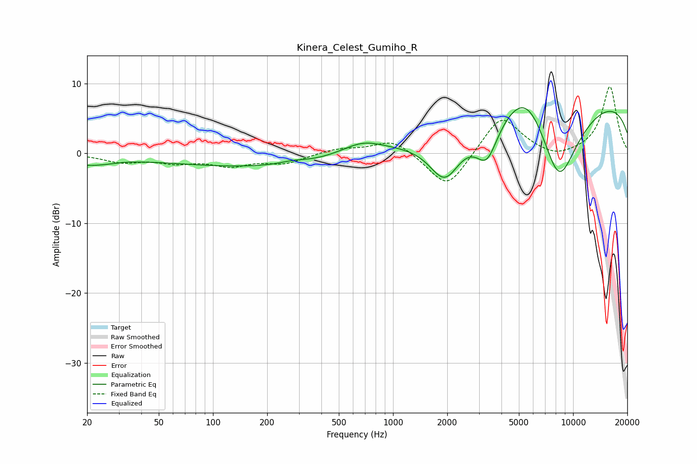

# Kinera_Celest_Gumiho_R
See [usage instructions](https://github.com/jaakkopasanen/AutoEq#usage) for more options and info.

### Parametric EQs
Apply preamp of -6.6 dB when using parametric equalizer.

|   # | Type    |   Fc (Hz) |    Q |   Gain (dB) |
|-----|---------|-----------|------|-------------|
|   1 | Peaking |        20 | 0.91 |        -1.4 |
|   2 | Peaking |        33 | 3    |         0.1 |
|   3 | Peaking |       175 | 0.29 |        -1.9 |
|   4 | Peaking |       278 | 1.99 |         0.4 |
|   5 | Peaking |       675 | 1.16 |         2   |
|   6 | Peaking |      1941 | 1.59 |        -6.6 |
|   7 | Peaking |      3322 | 2.27 |        -5.6 |
|   8 | Peaking |      5543 | 1.11 |         5.9 |
|   9 | Peaking |      8301 | 1.07 |       -13.5 |
|  10 | Peaking |     10000 | 0.18 |         8.7 |

### Fixed Band EQs
When using fixed band (also called graphic) equalizer, apply preamp of **-9.6 dB** (if available) and set gains manually with these parameters.

|   # | Type    |   Fc (Hz) |    Q |   Gain (dB) |
|-----|---------|-----------|------|-------------|
|   1 | Peaking |        31 | 1.41 |        -1.1 |
|   2 | Peaking |        62 | 1.41 |        -1.1 |
|   3 | Peaking |       125 | 1.41 |        -1.6 |
|   4 | Peaking |       250 | 1.41 |        -1.3 |
|   5 | Peaking |       500 | 1.41 |         0.7 |
|   6 | Peaking |      1000 | 1.41 |         2.1 |
|   7 | Peaking |      2000 | 1.41 |        -5.3 |
|   8 | Peaking |      4000 | 1.41 |         5.6 |
|   9 | Peaking |      8000 | 1.41 |        -0.9 |
|  10 | Peaking |     16000 | 1.41 |         9.6 |

### Graphs

