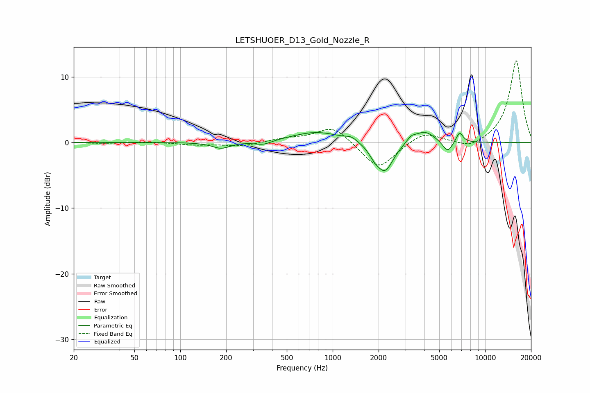

# LETSHUOER_D13_Gold_Nozzle_R
See [usage instructions](https://github.com/jaakkopasanen/AutoEq#usage) for more options and info.

### Parametric EQs
Apply preamp of -1.6 dB when using parametric equalizer.

|   # | Type    |   Fc (Hz) |    Q |   Gain (dB) |
|-----|---------|-----------|------|-------------|
|   1 | Peaking |       186 | 2.39 |        -0.9 |
|   2 | Peaking |       350 | 2.56 |        -0.6 |
|   3 | Peaking |       788 | 0.87 |         1.6 |
|   4 | Peaking |      1328 | 3.73 |         0.6 |
|   5 | Peaking |      1878 | 3.77 |        -1.1 |
|   6 | Peaking |      2206 | 2.54 |        -4.4 |
|   7 | Peaking |      3266 | 4.64 |         0.8 |
|   8 | Peaking |      4006 | 2.15 |         1.8 |
|   9 | Peaking |      5676 | 4.3  |        -1.7 |
|  10 | Peaking |      6793 | 6    |         1.6 |

### Fixed Band EQs
When using fixed band (also called graphic) equalizer, apply preamp of **-12.5 dB** (if available) and set gains manually with these parameters.

|   # | Type    |   Fc (Hz) |    Q |   Gain (dB) |
|-----|---------|-----------|------|-------------|
|   1 | Peaking |        31 | 1.41 |        -0.1 |
|   2 | Peaking |        62 | 1.41 |         0.1 |
|   3 | Peaking |       125 | 1.41 |        -0.3 |
|   4 | Peaking |       250 | 1.41 |        -0.6 |
|   5 | Peaking |       500 | 1.41 |         0.6 |
|   6 | Peaking |      1000 | 1.41 |         2.6 |
|   7 | Peaking |      2000 | 1.41 |        -4.2 |
|   8 | Peaking |      4000 | 1.41 |         1.7 |
|   9 | Peaking |      8000 | 1.41 |        -1.1 |
|  10 | Peaking |     16000 | 1.41 |        12.6 |

### Graphs

