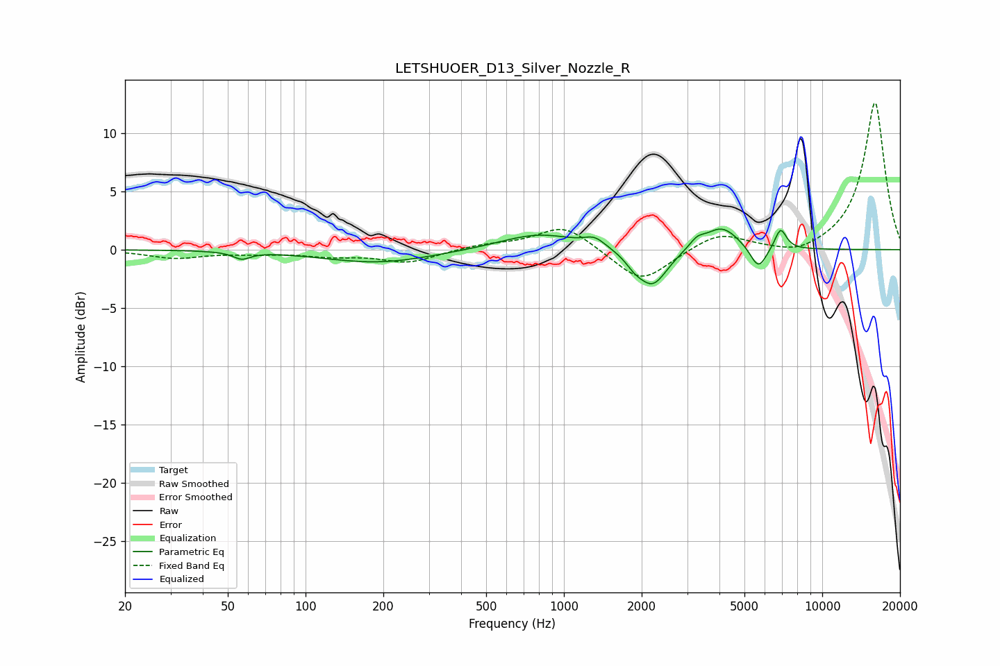

# LETSHUOER_D13_Silver_Nozzle_R
See [usage instructions](https://github.com/jaakkopasanen/AutoEq#usage) for more options and info.

### Parametric EQs
Apply preamp of -1.9 dB when using parametric equalizer.

|   # | Type    |   Fc (Hz) |    Q |   Gain (dB) |
|-----|---------|-----------|------|-------------|
|   1 | Peaking |        57 | 4.33 |        -0.6 |
|   2 | Peaking |       191 | 0.67 |        -1.1 |
|   3 | Peaking |       798 | 0.95 |         1.4 |
|   4 | Peaking |      1317 | 3.46 |         0.8 |
|   5 | Peaking |      1871 | 4.28 |        -0.7 |
|   6 | Peaking |      2203 | 2.43 |        -3.2 |
|   7 | Peaking |      3273 | 4.82 |         0.7 |
|   8 | Peaking |      4081 | 2.1  |         2   |
|   9 | Peaking |      5662 | 4.31 |        -2   |
|  10 | Peaking |      6898 | 5.99 |         1.8 |

### Fixed Band EQs
When using fixed band (also called graphic) equalizer, apply preamp of **-12.7 dB** (if available) and set gains manually with these parameters.

|   # | Type    |   Fc (Hz) |    Q |   Gain (dB) |
|-----|---------|-----------|------|-------------|
|   1 | Peaking |        31 | 1.41 |        -0.7 |
|   2 | Peaking |        62 | 1.41 |        -0.2 |
|   3 | Peaking |       125 | 1.41 |        -0.5 |
|   4 | Peaking |       250 | 1.41 |        -1.1 |
|   5 | Peaking |       500 | 1.41 |         0.4 |
|   6 | Peaking |      1000 | 1.41 |         2.1 |
|   7 | Peaking |      2000 | 1.41 |        -2.9 |
|   8 | Peaking |      4000 | 1.41 |         1.5 |
|   9 | Peaking |      8000 | 1.41 |        -0.7 |
|  10 | Peaking |     16000 | 1.41 |        12.7 |

### Graphs

