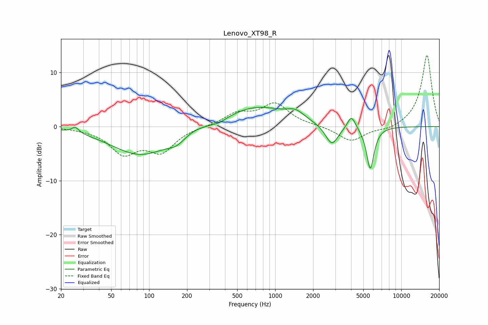

# Lenovo_XT98_R
See [usage instructions](https://github.com/jaakkopasanen/AutoEq#usage) for more options and info.

### Parametric EQs
Apply preamp of -3.6 dB when using parametric equalizer.

|   # | Type    |   Fc (Hz) |    Q |   Gain (dB) |
|-----|---------|-----------|------|-------------|
|   1 | Peaking |        26 | 4.97 |         1.1 |
|   2 | Peaking |        86 | 0.6  |        -5.2 |
|   3 | Peaking |       165 | 2.17 |        -1.2 |
|   4 | Peaking |       225 | 2.12 |         0.4 |
|   5 | Peaking |       360 | 2.32 |        -0.6 |
|   6 | Peaking |       708 | 0.57 |         3.7 |
|   7 | Peaking |      1451 | 2.11 |         1.4 |
|   8 | Peaking |      2817 | 2.73 |        -3.8 |
|   9 | Peaking |      4028 | 4.3  |         2.5 |
|  10 | Peaking |      5681 | 4.57 |        -7.9 |

### Fixed Band EQs
When using fixed band (also called graphic) equalizer, apply preamp of **-13.3 dB** (if available) and set gains manually with these parameters.

|   # | Type    |   Fc (Hz) |    Q |   Gain (dB) |
|-----|---------|-----------|------|-------------|
|   1 | Peaking |        31 | 1.41 |        -0.2 |
|   2 | Peaking |        62 | 1.41 |        -4.6 |
|   3 | Peaking |       125 | 1.41 |        -4.3 |
|   4 | Peaking |       250 | 1.41 |         0   |
|   5 | Peaking |       500 | 1.41 |         2.2 |
|   6 | Peaking |      1000 | 1.41 |         4.1 |
|   7 | Peaking |      2000 | 1.41 |         0.1 |
|   8 | Peaking |      4000 | 1.41 |        -2.8 |
|   9 | Peaking |      8000 | 1.41 |        -0.7 |
|  10 | Peaking |     16000 | 1.41 |        13.3 |

### Graphs

