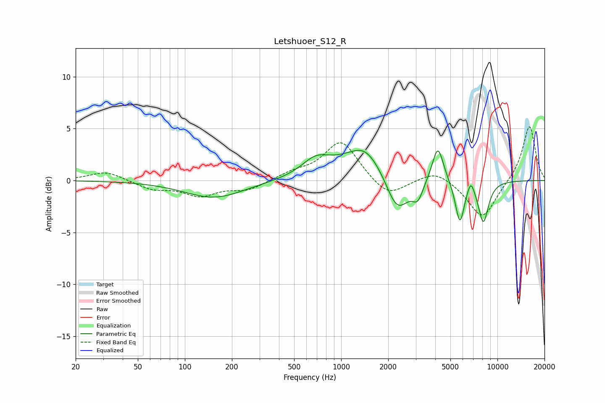

# Letshuoer_S12_R
See [usage instructions](https://github.com/jaakkopasanen/AutoEq#usage) for more options and info.

### Parametric EQs
Apply preamp of -3.0 dB when using parametric equalizer.

|   # | Type    |   Fc (Hz) |    Q |   Gain (dB) |
|-----|---------|-----------|------|-------------|
|   1 | Peaking |       154 | 0.74 |        -1.7 |
|   2 | Peaking |       686 | 1.59 |         1.5 |
|   3 | Peaking |      1411 | 1.89 |         0.8 |
|   4 | Peaking |      1453 | 0.76 |         2.8 |
|   5 | Peaking |      2279 | 1.82 |        -4.2 |
|   6 | Peaking |      3094 | 4.05 |        -1.7 |
|   7 | Peaking |      4156 | 3.92 |         3.5 |
|   8 | Peaking |      5749 | 4.7  |        -4.1 |
|   9 | Peaking |      6754 | 6    |         1.3 |
|  10 | Peaking |      8124 | 3.97 |        -4   |

### Fixed Band EQs
When using fixed band (also called graphic) equalizer, apply preamp of **-5.3 dB** (if available) and set gains manually with these parameters.

|   # | Type    |   Fc (Hz) |    Q |   Gain (dB) |
|-----|---------|-----------|------|-------------|
|   1 | Peaking |        31 | 1.41 |         0.9 |
|   2 | Peaking |        62 | 1.41 |        -0.8 |
|   3 | Peaking |       125 | 1.41 |        -1.4 |
|   4 | Peaking |       250 | 1.41 |        -0.9 |
|   5 | Peaking |       500 | 1.41 |         0.6 |
|   6 | Peaking |      1000 | 1.41 |         3.8 |
|   7 | Peaking |      2000 | 1.41 |        -1.7 |
|   8 | Peaking |      4000 | 1.41 |         1.1 |
|   9 | Peaking |      8000 | 1.41 |        -3.7 |
|  10 | Peaking |     16000 | 1.41 |         5.4 |

### Graphs

