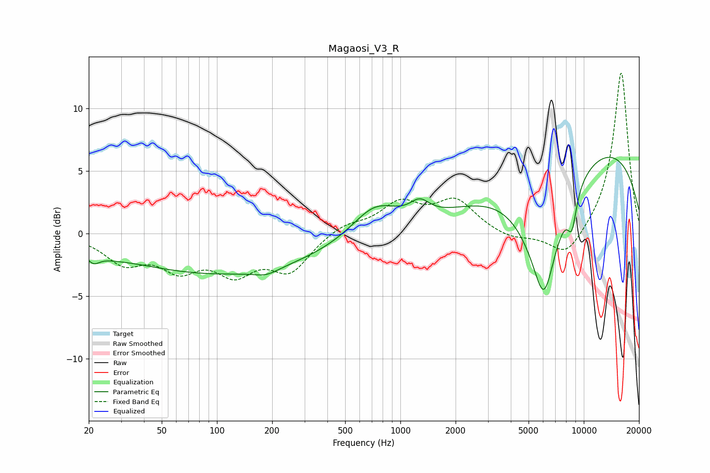

# Magaosi_V3_R
See [usage instructions](https://github.com/jaakkopasanen/AutoEq#usage) for more options and info.

### Parametric EQs
Apply preamp of -6.2 dB when using parametric equalizer.

|   # | Type    |   Fc (Hz) |    Q |   Gain (dB) |
|-----|---------|-----------|------|-------------|
|   1 | Peaking |        21 | 4.09 |        -0.9 |
|   2 | Peaking |        26 | 1.26 |        -0.4 |
|   3 | Peaking |       108 | 0.26 |        -3.2 |
|   4 | Peaking |       186 | 2.15 |        -0.5 |
|   5 | Peaking |       726 | 1.13 |         2.4 |
|   6 | Peaking |      1276 | 2.68 |         1.2 |
|   7 | Peaking |      6005 | 1.02 |        -7.8 |
|   8 | Peaking |      6065 | 2.92 |        -3.4 |
|   9 | Peaking |      8622 | 5.2  |        -2.6 |
|  10 | Peaking |     10000 | 0.23 |         7.6 |

### Fixed Band EQs
When using fixed band (also called graphic) equalizer, apply preamp of **-12.9 dB** (if available) and set gains manually with these parameters.

|   # | Type    |   Fc (Hz) |    Q |   Gain (dB) |
|-----|---------|-----------|------|-------------|
|   1 | Peaking |        31 | 1.41 |        -2.1 |
|   2 | Peaking |        62 | 1.41 |        -2.4 |
|   3 | Peaking |       125 | 1.41 |        -2.7 |
|   4 | Peaking |       250 | 1.41 |        -2.8 |
|   5 | Peaking |       500 | 1.41 |         0.8 |
|   6 | Peaking |      1000 | 1.41 |         2.3 |
|   7 | Peaking |      2000 | 1.41 |         2.5 |
|   8 | Peaking |      4000 | 1.41 |        -0.5 |
|   9 | Peaking |      8000 | 1.41 |        -2.1 |
|  10 | Peaking |     16000 | 1.41 |        13   |

### Graphs

