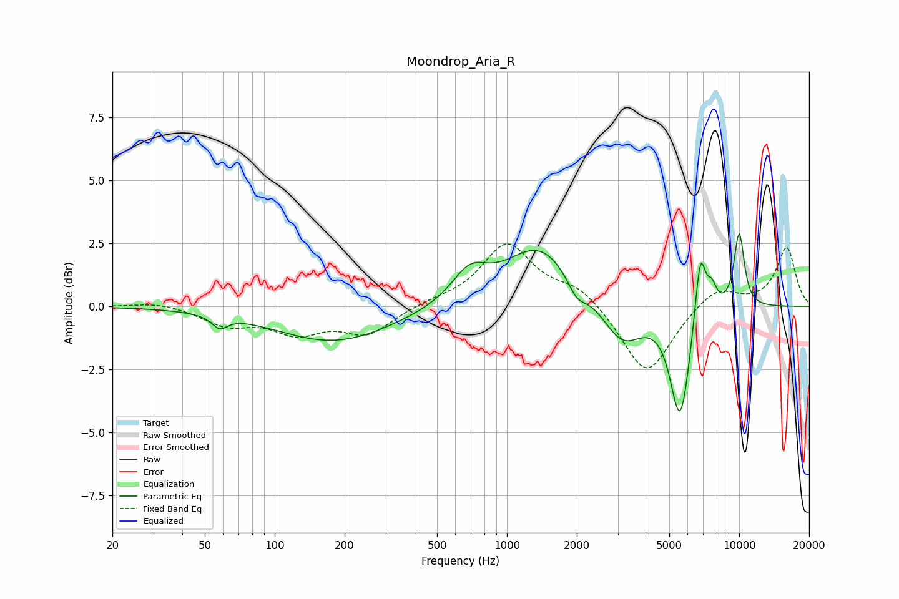

# Moondrop_Aria_R
See [usage instructions](https://github.com/jaakkopasanen/AutoEq#usage) for more options and info.

### Parametric EQs
Apply preamp of -3.0 dB when using parametric equalizer.

|   # | Type    |   Fc (Hz) |    Q |   Gain (dB) |
|-----|---------|-----------|------|-------------|
|   1 | Peaking |        58 | 4.32 |        -0.5 |
|   2 | Peaking |       180 | 0.56 |        -1.4 |
|   3 | Peaking |       691 | 1.81 |         1.2 |
|   4 | Peaking |      1383 | 0.96 |         2.4 |
|   5 | Peaking |      1997 | 3.52 |        -0.7 |
|   6 | Peaking |      3135 | 1.64 |        -1.6 |
|   7 | Peaking |      5571 | 3.26 |        -4.4 |
|   8 | Peaking |      6800 | 5.86 |         2.7 |
|   9 | Peaking |      7624 | 5.9  |         0.9 |
|  10 | Peaking |     10000 | 5.38 |         3   |

### Fixed Band EQs
When using fixed band (also called graphic) equalizer, apply preamp of **-2.6 dB** (if available) and set gains manually with these parameters.

|   # | Type    |   Fc (Hz) |    Q |   Gain (dB) |
|-----|---------|-----------|------|-------------|
|   1 | Peaking |        31 | 1.41 |         0.2 |
|   2 | Peaking |        62 | 1.41 |        -0.7 |
|   3 | Peaking |       125 | 1.41 |        -0.9 |
|   4 | Peaking |       250 | 1.41 |        -1.1 |
|   5 | Peaking |       500 | 1.41 |         0.2 |
|   6 | Peaking |      1000 | 1.41 |         2.4 |
|   7 | Peaking |      2000 | 1.41 |         0.7 |
|   8 | Peaking |      4000 | 1.41 |        -2.8 |
|   9 | Peaking |      8000 | 1.41 |         0.8 |
|  10 | Peaking |     16000 | 1.41 |         2.3 |

### Graphs

