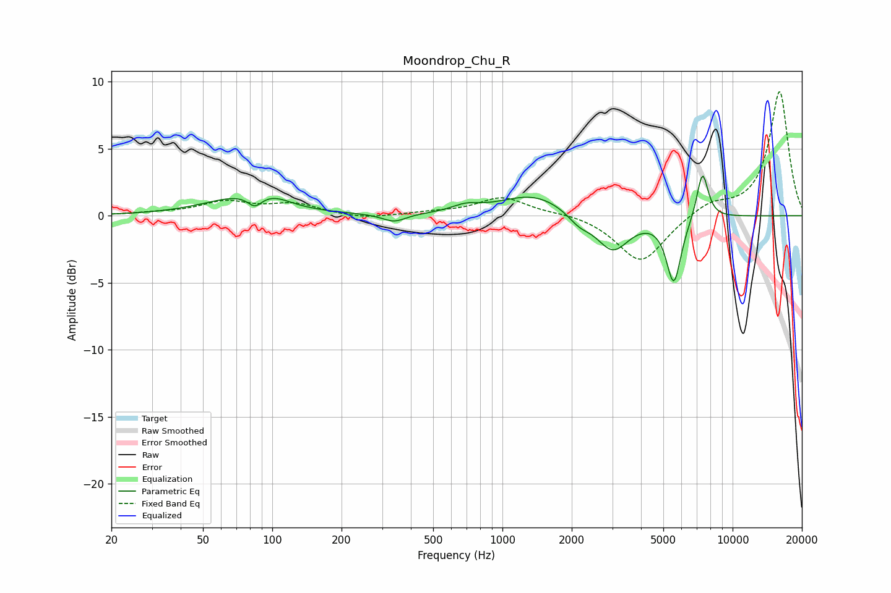

# Moondrop_Chu_R
See [usage instructions](https://github.com/jaakkopasanen/AutoEq#usage) for more options and info.

### Parametric EQs
Apply preamp of -3.1 dB when using parametric equalizer.

|   # | Type    |   Fc (Hz) |    Q |   Gain (dB) |
|-----|---------|-----------|------|-------------|
|   1 | Peaking |        73 | 0.89 |         1.3 |
|   2 | Peaking |        84 | 4.65 |        -0.8 |
|   3 | Peaking |       102 | 1.94 |         0.5 |
|   4 | Peaking |       338 | 2.75 |        -0.6 |
|   5 | Peaking |       692 | 2.38 |         0.5 |
|   6 | Peaking |      1372 | 0.97 |         1.6 |
|   7 | Peaking |      2154 | 2.82 |        -0.8 |
|   8 | Peaking |      3014 | 1.98 |        -2.7 |
|   9 | Peaking |      5554 | 4.32 |        -4.9 |
|  10 | Peaking |      7396 | 5.33 |         3.6 |

### Fixed Band EQs
When using fixed band (also called graphic) equalizer, apply preamp of **-9.4 dB** (if available) and set gains manually with these parameters.

|   # | Type    |   Fc (Hz) |    Q |   Gain (dB) |
|-----|---------|-----------|------|-------------|
|   1 | Peaking |        31 | 1.41 |         0.2 |
|   2 | Peaking |        62 | 1.41 |         1   |
|   3 | Peaking |       125 | 1.41 |         0.8 |
|   4 | Peaking |       250 | 1.41 |        -0.3 |
|   5 | Peaking |       500 | 1.41 |         0.2 |
|   6 | Peaking |      1000 | 1.41 |         1.4 |
|   7 | Peaking |      2000 | 1.41 |         0.2 |
|   8 | Peaking |      4000 | 1.41 |        -3.6 |
|   9 | Peaking |      8000 | 1.41 |         0.9 |
|  10 | Peaking |     16000 | 1.41 |         9.3 |

### Graphs

