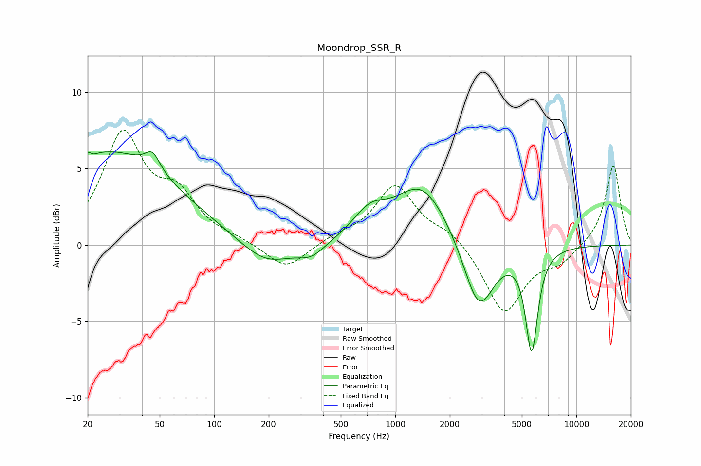

# Moondrop_SSR_R
See [usage instructions](https://github.com/jaakkopasanen/AutoEq#usage) for more options and info.

### Parametric EQs
Apply preamp of -6.2 dB when using parametric equalizer.

|   # | Type    |   Fc (Hz) |    Q |   Gain (dB) |
|-----|---------|-----------|------|-------------|
|   1 | Peaking |        21 | 5.92 |         3.2 |
|   2 | Peaking |        21 | 5.97 |        -3.1 |
|   3 | Peaking |        26 | 0.38 |         6   |
|   4 | Peaking |        46 | 3.5  |         1.2 |
|   5 | Peaking |       193 | 0.99 |        -1.6 |
|   6 | Peaking |       345 | 1.87 |        -0.8 |
|   7 | Peaking |       724 | 1.5  |         1.6 |
|   8 | Peaking |      1409 | 0.95 |         3.9 |
|   9 | Peaking |      2893 | 1.69 |        -4.7 |
|  10 | Peaking |      5663 | 4.13 |        -6.6 |

### Fixed Band EQs
When using fixed band (also called graphic) equalizer, apply preamp of **-7.6 dB** (if available) and set gains manually with these parameters.

|   # | Type    |   Fc (Hz) |    Q |   Gain (dB) |
|-----|---------|-----------|------|-------------|
|   1 | Peaking |        31 | 1.41 |         7   |
|   2 | Peaking |        62 | 1.41 |         2.8 |
|   3 | Peaking |       125 | 1.41 |         0.3 |
|   4 | Peaking |       250 | 1.41 |        -1.7 |
|   5 | Peaking |       500 | 1.41 |         0.5 |
|   6 | Peaking |      1000 | 1.41 |         3.8 |
|   7 | Peaking |      2000 | 1.41 |         0.9 |
|   8 | Peaking |      4000 | 1.41 |        -4.5 |
|   9 | Peaking |      8000 | 1.41 |        -1   |
|  10 | Peaking |     16000 | 1.41 |         5.3 |

### Graphs

