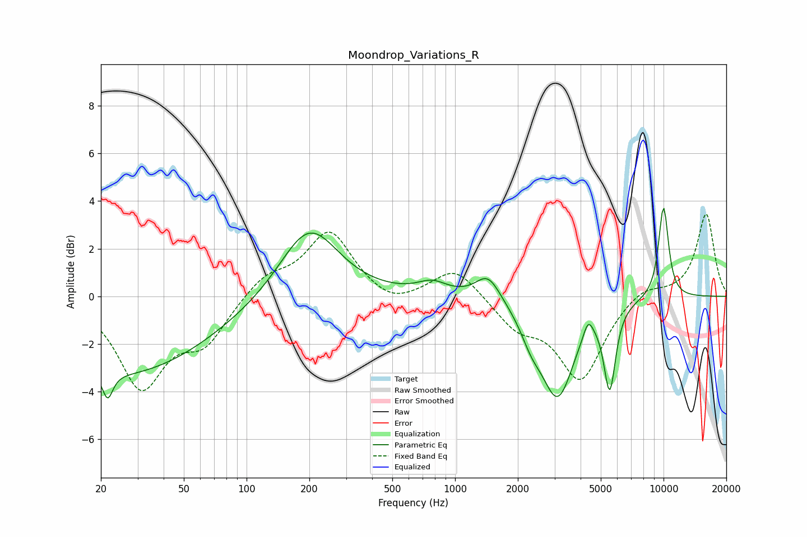

# Moondrop_Variations_R
See [usage instructions](https://github.com/jaakkopasanen/AutoEq#usage) for more options and info.

### Parametric EQs
Apply preamp of -3.8 dB when using parametric equalizer.

|   # | Type    |   Fc (Hz) |    Q |   Gain (dB) |
|-----|---------|-----------|------|-------------|
|   1 | Peaking |        22 | 5.92 |        -1.1 |
|   2 | Peaking |        25 | 0.33 |        -3.3 |
|   3 | Peaking |       199 | 1.02 |         3.1 |
|   4 | Peaking |       778 | 2.01 |         0.5 |
|   5 | Peaking |      1440 | 2.38 |         1.1 |
|   6 | Peaking |      2324 | 2.68 |        -0.9 |
|   7 | Peaking |      3108 | 1.81 |        -4   |
|   8 | Peaking |      4351 | 6    |         0.7 |
|   9 | Peaking |      5519 | 5.01 |        -3.4 |
|  10 | Peaking |     10000 | 4.93 |         3.9 |

### Fixed Band EQs
When using fixed band (also called graphic) equalizer, apply preamp of **-3.5 dB** (if available) and set gains manually with these parameters.

|   # | Type    |   Fc (Hz) |    Q |   Gain (dB) |
|-----|---------|-----------|------|-------------|
|   1 | Peaking |        31 | 1.41 |        -3.7 |
|   2 | Peaking |        62 | 1.41 |        -1.8 |
|   3 | Peaking |       125 | 1.41 |         0.9 |
|   4 | Peaking |       250 | 1.41 |         2.7 |
|   5 | Peaking |       500 | 1.41 |        -0.5 |
|   6 | Peaking |      1000 | 1.41 |         1.3 |
|   7 | Peaking |      2000 | 1.41 |        -1.2 |
|   8 | Peaking |      4000 | 1.41 |        -3.4 |
|   9 | Peaking |      8000 | 1.41 |         0.5 |
|  10 | Peaking |     16000 | 1.41 |         3.5 |

### Graphs

