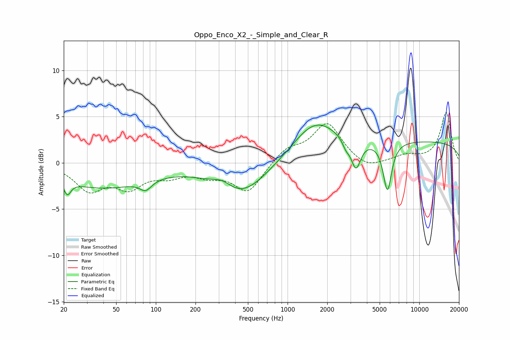

# Oppo_Enco_X2_-_Simple_and_Clear_R
See [usage instructions](https://github.com/jaakkopasanen/AutoEq#usage) for more options and info.

### Parametric EQs
Apply preamp of -4.2 dB when using parametric equalizer.

|   # | Type    |   Fc (Hz) |    Q |   Gain (dB) |
|-----|---------|-----------|------|-------------|
|   1 | Peaking |        21 | 5.44 |        -1.4 |
|   2 | Peaking |        39 | 0.43 |        -2.6 |
|   3 | Peaking |        84 | 3.19 |        -1.1 |
|   4 | Peaking |       321 | 1.91 |         0.9 |
|   5 | Peaking |       437 | 0.72 |        -3.6 |
|   6 | Peaking |      1608 | 0.83 |         3.8 |
|   7 | Peaking |      2774 | 5.11 |        -0.9 |
|   8 | Peaking |      3303 | 3.9  |        -3.1 |
|   9 | Peaking |      5725 | 4.31 |        -5.3 |
|  10 | Peaking |     10000 | 0.18 |         2.3 |

### Fixed Band EQs
When using fixed band (also called graphic) equalizer, apply preamp of **-5.5 dB** (if available) and set gains manually with these parameters.

|   # | Type    |   Fc (Hz) |    Q |   Gain (dB) |
|-----|---------|-----------|------|-------------|
|   1 | Peaking |        31 | 1.41 |        -2.8 |
|   2 | Peaking |        62 | 1.41 |        -2.4 |
|   3 | Peaking |       125 | 1.41 |        -1.1 |
|   4 | Peaking |       250 | 1.41 |        -1.1 |
|   5 | Peaking |       500 | 1.41 |        -3.1 |
|   6 | Peaking |      1000 | 1.41 |         1.5 |
|   7 | Peaking |      2000 | 1.41 |         4.2 |
|   8 | Peaking |      4000 | 1.41 |        -0.8 |
|   9 | Peaking |      8000 | 1.41 |         0.7 |
|  10 | Peaking |     16000 | 1.41 |         5.4 |

### Graphs

