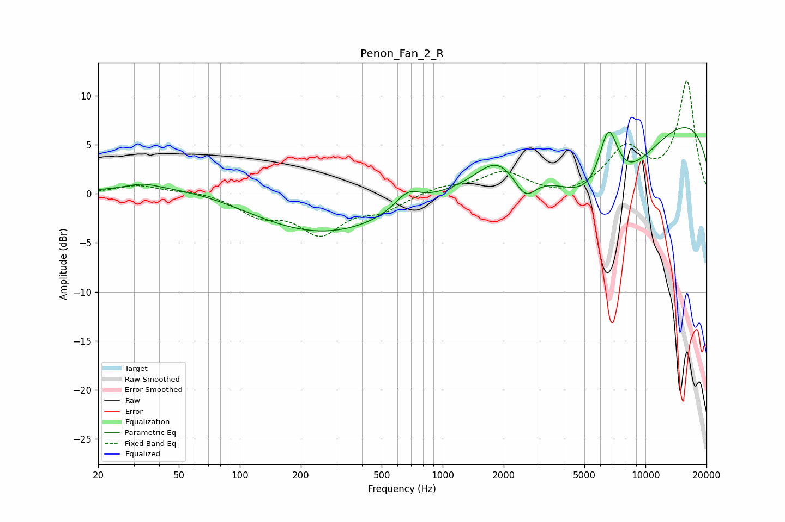

# Penon_Fan_2_R
See [usage instructions](https://github.com/jaakkopasanen/AutoEq#usage) for more options and info.

### Parametric EQs
Apply preamp of -6.8 dB when using parametric equalizer.

|   # | Type    |   Fc (Hz) |    Q |   Gain (dB) |
|-----|---------|-----------|------|-------------|
|   1 | Peaking |        31 | 1.46 |        -0.1 |
|   2 | Peaking |        33 | 1.88 |         0.6 |
|   3 | Peaking |        75 | 0.39 |         1.8 |
|   4 | Peaking |       222 | 0.36 |        -4.8 |
|   5 | Peaking |       672 | 2.22 |         1.8 |
|   6 | Peaking |      1833 | 1.59 |         2.1 |
|   7 | Peaking |      2556 | 2.67 |        -2.4 |
|   8 | Peaking |      6213 | 0.58 |       -10.6 |
|   9 | Peaking |      6565 | 2.54 |         7.6 |
|  10 | Peaking |      9997 | 0.19 |         9.8 |

### Fixed Band EQs
When using fixed band (also called graphic) equalizer, apply preamp of **-11.6 dB** (if available) and set gains manually with these parameters.

|   # | Type    |   Fc (Hz) |    Q |   Gain (dB) |
|-----|---------|-----------|------|-------------|
|   1 | Peaking |        31 | 1.41 |         0.9 |
|   2 | Peaking |        62 | 1.41 |         0.3 |
|   3 | Peaking |       125 | 1.41 |        -2   |
|   4 | Peaking |       250 | 1.41 |        -3.8 |
|   5 | Peaking |       500 | 1.41 |        -1.5 |
|   6 | Peaking |      1000 | 1.41 |         0.7 |
|   7 | Peaking |      2000 | 1.41 |         2.2 |
|   8 | Peaking |      4000 | 1.41 |        -0.6 |
|   9 | Peaking |      8000 | 1.41 |         4.4 |
|  10 | Peaking |     16000 | 1.41 |        11.4 |

### Graphs

