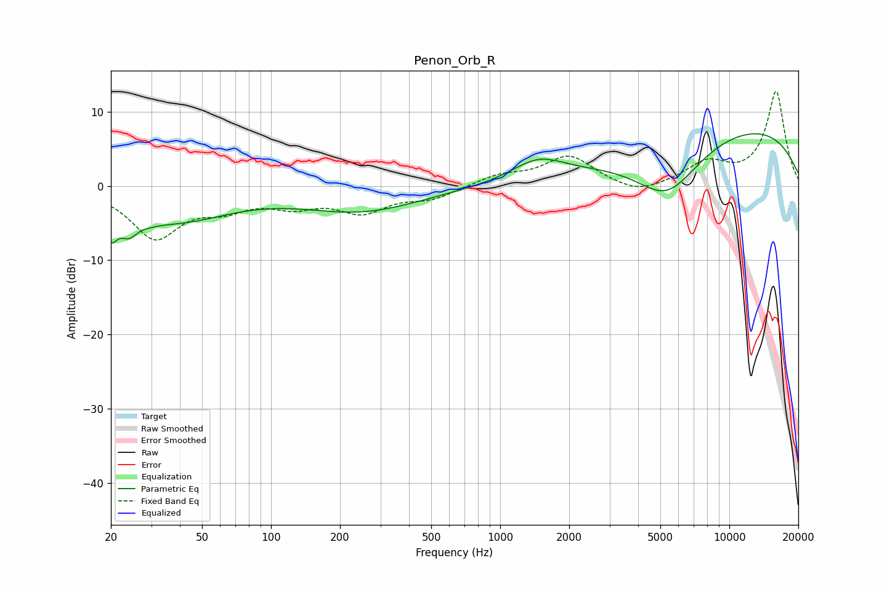

# Penon_Orb_R
See [usage instructions](https://github.com/jaakkopasanen/AutoEq#usage) for more options and info.

### Parametric EQs
Apply preamp of -7.1 dB when using parametric equalizer.

|   # | Type    |   Fc (Hz) |    Q |   Gain (dB) |
|-----|---------|-----------|------|-------------|
|   1 | Peaking |        20 | 5.88 |        -3.2 |
|   2 | Peaking |        22 | 2.46 |        -1.1 |
|   3 | Peaking |        24 | 4.07 |        -1.9 |
|   4 | Peaking |        29 | 3.15 |        -0.4 |
|   5 | Peaking |        38 | 0.59 |        -4.5 |
|   6 | Peaking |       249 | 0.54 |        -3.3 |
|   7 | Peaking |      1465 | 1.23 |         2.9 |
|   8 | Peaking |      5339 | 0.91 |        -7.9 |
|   9 | Peaking |      9774 | 0.24 |         6   |
|  10 | Peaking |      9869 | 0.26 |         2.5 |

### Fixed Band EQs
When using fixed band (also called graphic) equalizer, apply preamp of **-12.9 dB** (if available) and set gains manually with these parameters.

|   # | Type    |   Fc (Hz) |    Q |   Gain (dB) |
|-----|---------|-----------|------|-------------|
|   1 | Peaking |        31 | 1.41 |        -6.7 |
|   2 | Peaking |        62 | 1.41 |        -2.3 |
|   3 | Peaking |       125 | 1.41 |        -2.2 |
|   4 | Peaking |       250 | 1.41 |        -3.2 |
|   5 | Peaking |       500 | 1.41 |        -1.5 |
|   6 | Peaking |      1000 | 1.41 |         1.3 |
|   7 | Peaking |      2000 | 1.41 |         4   |
|   8 | Peaking |      4000 | 1.41 |        -1.4 |
|   9 | Peaking |      8000 | 1.41 |         2.9 |
|  10 | Peaking |     16000 | 1.41 |        12.7 |

### Graphs

