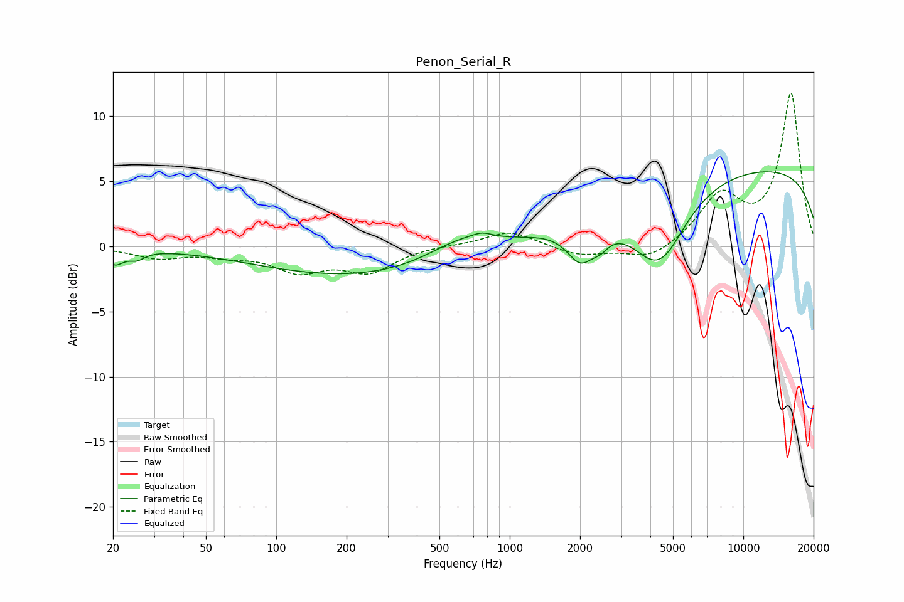

# Penon_Serial_R
See [usage instructions](https://github.com/jaakkopasanen/AutoEq#usage) for more options and info.

### Parametric EQs
Apply preamp of -5.8 dB when using parametric equalizer.

|   # | Type    |   Fc (Hz) |    Q |   Gain (dB) |
|-----|---------|-----------|------|-------------|
|   1 | Peaking |        20 | 3.71 |        -1.1 |
|   2 | Peaking |        25 | 4.27 |        -0.6 |
|   3 | Peaking |       232 | 0.32 |        -2.4 |
|   4 | Peaking |       622 | 0.95 |         1.6 |
|   5 | Peaking |       761 | 3.53 |         0.4 |
|   6 | Peaking |      2014 | 2.36 |        -2.7 |
|   7 | Peaking |      2450 | 3.96 |        -0.8 |
|   8 | Peaking |      4329 | 1.19 |        -5.9 |
|   9 | Peaking |      4886 | 3.45 |        -0.1 |
|  10 | Peaking |     10000 | 0.18 |         6.2 |

### Fixed Band EQs
When using fixed band (also called graphic) equalizer, apply preamp of **-11.8 dB** (if available) and set gains manually with these parameters.

|   # | Type    |   Fc (Hz) |    Q |   Gain (dB) |
|-----|---------|-----------|------|-------------|
|   1 | Peaking |        31 | 1.41 |        -0.8 |
|   2 | Peaking |        62 | 1.41 |        -0.5 |
|   3 | Peaking |       125 | 1.41 |        -1.7 |
|   4 | Peaking |       250 | 1.41 |        -1.8 |
|   5 | Peaking |       500 | 1.41 |         0.1 |
|   6 | Peaking |      1000 | 1.41 |         1.2 |
|   7 | Peaking |      2000 | 1.41 |        -0.7 |
|   8 | Peaking |      4000 | 1.41 |        -1.1 |
|   9 | Peaking |      8000 | 1.41 |         3.7 |
|  10 | Peaking |     16000 | 1.41 |        11.7 |

### Graphs

