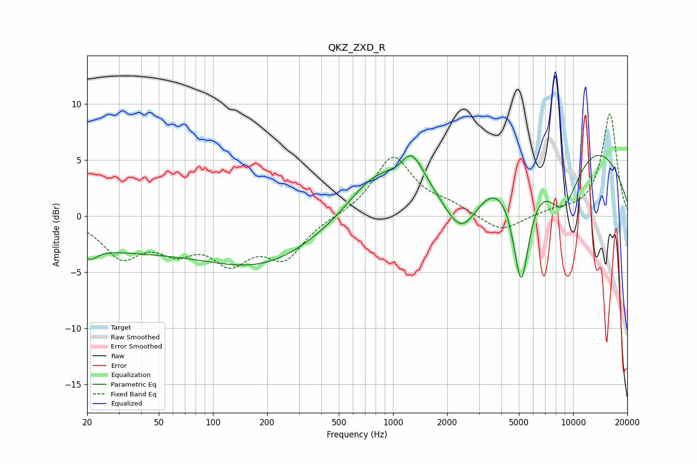

# QKZ_ZXD_R
See [usage instructions](https://github.com/jaakkopasanen/AutoEq#usage) for more options and info.

### Parametric EQs
Apply preamp of -5.5 dB when using parametric equalizer.

|   # | Type    |   Fc (Hz) |    Q |   Gain (dB) |
|-----|---------|-----------|------|-------------|
|   1 | Peaking |        21 | 3.61 |        -1   |
|   2 | Peaking |        28 | 0.3  |        -2.7 |
|   3 | Peaking |       189 | 0.45 |        -3.9 |
|   4 | Peaking |       753 | 0.99 |         2.9 |
|   5 | Peaking |      1104 | 2.57 |        -1.4 |
|   6 | Peaking |      1222 | 1.73 |         4.7 |
|   7 | Peaking |      2412 | 1.36 |        -5.2 |
|   8 | Peaking |      5148 | 2.83 |       -10.6 |
|   9 | Peaking |      8413 | 0.25 |         8.3 |
|  10 | Peaking |      8762 | 1.25 |        -6.5 |

### Fixed Band EQs
When using fixed band (also called graphic) equalizer, apply preamp of **-9.2 dB** (if available) and set gains manually with these parameters.

|   # | Type    |   Fc (Hz) |    Q |   Gain (dB) |
|-----|---------|-----------|------|-------------|
|   1 | Peaking |        31 | 1.41 |        -3.4 |
|   2 | Peaking |        62 | 1.41 |        -2.4 |
|   3 | Peaking |       125 | 1.41 |        -3.5 |
|   4 | Peaking |       250 | 1.41 |        -3.4 |
|   5 | Peaking |       500 | 1.41 |        -0   |
|   6 | Peaking |      1000 | 1.41 |         5.3 |
|   7 | Peaking |      2000 | 1.41 |         0.8 |
|   8 | Peaking |      4000 | 1.41 |        -1.5 |
|   9 | Peaking |      8000 | 1.41 |         0.4 |
|  10 | Peaking |     16000 | 1.41 |         9.1 |

### Graphs

