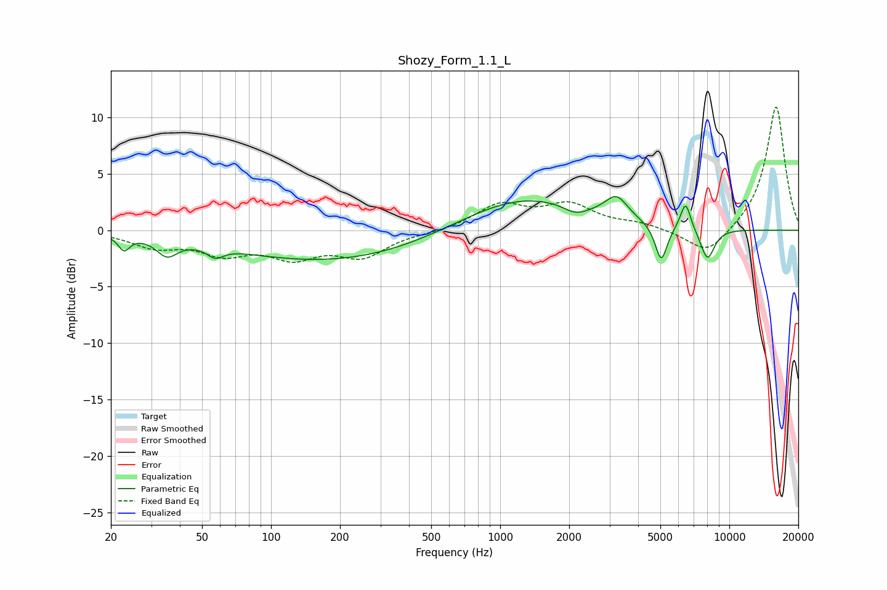

# Shozy_Form_1.1_L
See [usage instructions](https://github.com/jaakkopasanen/AutoEq#usage) for more options and info.

### Parametric EQs
Apply preamp of -3.1 dB when using parametric equalizer.

|   # | Type    |   Fc (Hz) |    Q |   Gain (dB) |
|-----|---------|-----------|------|-------------|
|   1 | Peaking |        23 | 5.86 |        -1.3 |
|   2 | Peaking |        35 | 3.18 |        -1.5 |
|   3 | Peaking |        57 | 4.07 |        -0.9 |
|   4 | Peaking |       184 | 0.32 |        -2.8 |
|   5 | Peaking |      1245 | 0.51 |         3.1 |
|   6 | Peaking |      2133 | 2.71 |        -0.8 |
|   7 | Peaking |      3218 | 2.86 |         1.9 |
|   8 | Peaking |      5043 | 5.26 |        -3.3 |
|   9 | Peaking |      6445 | 6    |         2.5 |
|  10 | Peaking |      8029 | 4.25 |        -2.8 |

### Fixed Band EQs
When using fixed band (also called graphic) equalizer, apply preamp of **-11.0 dB** (if available) and set gains manually with these parameters.

|   # | Type    |   Fc (Hz) |    Q |   Gain (dB) |
|-----|---------|-----------|------|-------------|
|   1 | Peaking |        31 | 1.41 |        -1.3 |
|   2 | Peaking |        62 | 1.41 |        -1.8 |
|   3 | Peaking |       125 | 1.41 |        -2.1 |
|   4 | Peaking |       250 | 1.41 |        -2.2 |
|   5 | Peaking |       500 | 1.41 |        -0.2 |
|   6 | Peaking |      1000 | 1.41 |         2.2 |
|   7 | Peaking |      2000 | 1.41 |         2.1 |
|   8 | Peaking |      4000 | 1.41 |         0.5 |
|   9 | Peaking |      8000 | 1.41 |        -2.3 |
|  10 | Peaking |     16000 | 1.41 |        11.1 |

### Graphs

