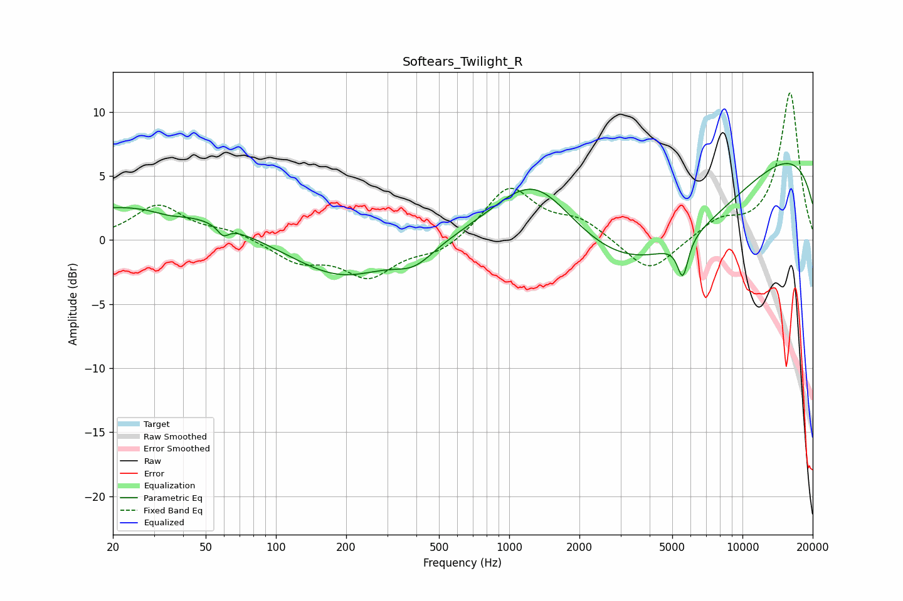

# Softears_Twilight_R
See [usage instructions](https://github.com/jaakkopasanen/AutoEq#usage) for more options and info.

### Parametric EQs
Apply preamp of -6.1 dB when using parametric equalizer.

|   # | Type    |   Fc (Hz) |    Q |   Gain (dB) |
|-----|---------|-----------|------|-------------|
|   1 | Peaking |        35 | 1.92 |        -0.4 |
|   2 | Peaking |        51 | 0.18 |         3.4 |
|   3 | Peaking |        59 | 5.93 |        -0.8 |
|   4 | Peaking |       137 | 0.44 |        -3.1 |
|   5 | Peaking |       194 | 0.75 |        -2.2 |
|   6 | Peaking |       392 | 1.62 |        -1.5 |
|   7 | Peaking |      1290 | 0.73 |         7   |
|   8 | Peaking |      3707 | 0.33 |        -9.1 |
|   9 | Peaking |      5549 | 6    |        -2.9 |
|  10 | Peaking |     10000 | 0.18 |         8.4 |

### Fixed Band EQs
When using fixed band (also called graphic) equalizer, apply preamp of **-11.6 dB** (if available) and set gains manually with these parameters.

|   # | Type    |   Fc (Hz) |    Q |   Gain (dB) |
|-----|---------|-----------|------|-------------|
|   1 | Peaking |        31 | 1.41 |         2.7 |
|   2 | Peaking |        62 | 1.41 |         0.7 |
|   3 | Peaking |       125 | 1.41 |        -1.6 |
|   4 | Peaking |       250 | 1.41 |        -2.7 |
|   5 | Peaking |       500 | 1.41 |        -1   |
|   6 | Peaking |      1000 | 1.41 |         4.1 |
|   7 | Peaking |      2000 | 1.41 |         1.4 |
|   8 | Peaking |      4000 | 1.41 |        -2.7 |
|   9 | Peaking |      8000 | 1.41 |         1.4 |
|  10 | Peaking |     16000 | 1.41 |        11.5 |

### Graphs

