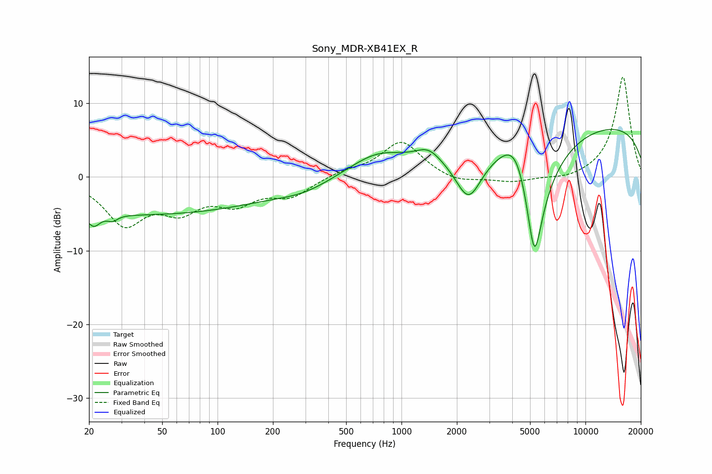

# Sony_MDR-XB41EX_R
See [usage instructions](https://github.com/jaakkopasanen/AutoEq#usage) for more options and info.

### Parametric EQs
Apply preamp of -6.6 dB when using parametric equalizer.

|   # | Type    |   Fc (Hz) |    Q |   Gain (dB) |
|-----|---------|-----------|------|-------------|
|   1 | Peaking |        21 | 4.21 |        -1.8 |
|   2 | Peaking |        27 | 5.39 |        -0.7 |
|   3 | Peaking |        38 | 0.18 |        -5.1 |
|   4 | Peaking |       296 | 0.97 |        -1.1 |
|   5 | Peaking |       742 | 0.89 |         3   |
|   6 | Peaking |      1399 | 2.02 |         1.9 |
|   7 | Peaking |      2316 | 1.96 |        -6.2 |
|   8 | Peaking |      4263 | 1.59 |         6.5 |
|   9 | Peaking |      5277 | 1.99 |       -20   |
|  10 | Peaking |     10000 | 0.18 |         7.5 |

### Fixed Band EQs
When using fixed band (also called graphic) equalizer, apply preamp of **-13.7 dB** (if available) and set gains manually with these parameters.

|   # | Type    |   Fc (Hz) |    Q |   Gain (dB) |
|-----|---------|-----------|------|-------------|
|   1 | Peaking |        31 | 1.41 |        -6   |
|   2 | Peaking |        62 | 1.41 |        -3.8 |
|   3 | Peaking |       125 | 1.41 |        -3.1 |
|   4 | Peaking |       250 | 1.41 |        -2.4 |
|   5 | Peaking |       500 | 1.41 |         0.7 |
|   6 | Peaking |      1000 | 1.41 |         4.9 |
|   7 | Peaking |      2000 | 1.41 |        -0.9 |
|   8 | Peaking |      4000 | 1.41 |        -0.7 |
|   9 | Peaking |      8000 | 1.41 |        -0.5 |
|  10 | Peaking |     16000 | 1.41 |        13.7 |

### Graphs

