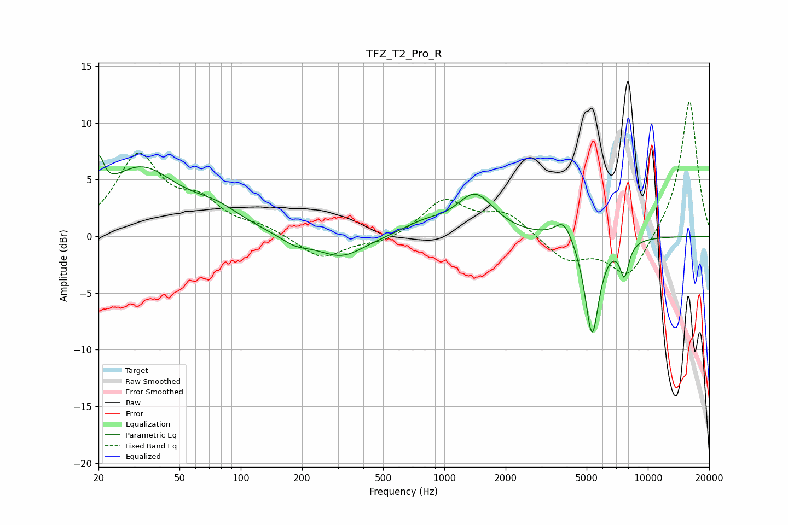

# TFZ_T2_Pro_R
See [usage instructions](https://github.com/jaakkopasanen/AutoEq#usage) for more options and info.

### Parametric EQs
Apply preamp of -7.2 dB when using parametric equalizer.

|   # | Type    |   Fc (Hz) |    Q |   Gain (dB) |
|-----|---------|-----------|------|-------------|
|   1 | Peaking |        20 | 5.59 |         3.4 |
|   2 | Peaking |        32 | 0.78 |         5.8 |
|   3 | Peaking |        76 | 1.12 |         1.5 |
|   4 | Peaking |       184 | 1.94 |        -0.8 |
|   5 | Peaking |       312 | 1.2  |        -1.9 |
|   6 | Peaking |       792 | 1.26 |         1   |
|   7 | Peaking |      1419 | 1.55 |         3.5 |
|   8 | Peaking |      3868 | 3.21 |         1.8 |
|   9 | Peaking |      5317 | 3.96 |        -8.8 |
|  10 | Peaking |      7665 | 5.91 |        -2.9 |

### Fixed Band EQs
When using fixed band (also called graphic) equalizer, apply preamp of **-12.0 dB** (if available) and set gains manually with these parameters.

|   # | Type    |   Fc (Hz) |    Q |   Gain (dB) |
|-----|---------|-----------|------|-------------|
|   1 | Peaking |        31 | 1.41 |         6.9 |
|   2 | Peaking |        62 | 1.41 |         2.5 |
|   3 | Peaking |       125 | 1.41 |         0.7 |
|   4 | Peaking |       250 | 1.41 |        -2   |
|   5 | Peaking |       500 | 1.41 |        -0.6 |
|   6 | Peaking |      1000 | 1.41 |         3.1 |
|   7 | Peaking |      2000 | 1.41 |         2   |
|   8 | Peaking |      4000 | 1.41 |        -2.1 |
|   9 | Peaking |      8000 | 1.41 |        -3.8 |
|  10 | Peaking |     16000 | 1.41 |        12.1 |

### Graphs

