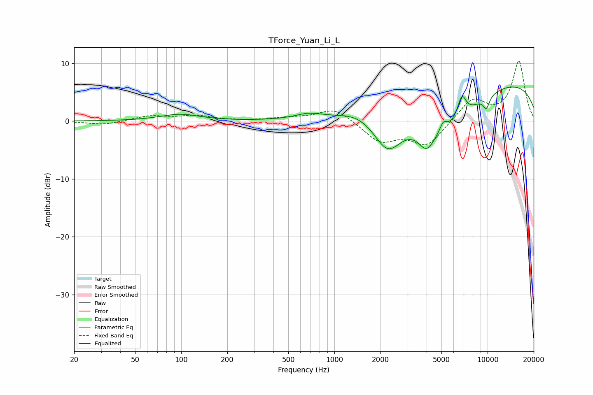

# TForce_Yuan_Li_L
See [usage instructions](https://github.com/jaakkopasanen/AutoEq#usage) for more options and info.

### Parametric EQs
Apply preamp of -6.0 dB when using parametric equalizer.

|   # | Type    |   Fc (Hz) |    Q |   Gain (dB) |
|-----|---------|-----------|------|-------------|
|   1 | Peaking |        98 | 1.11 |         1.2 |
|   2 | Peaking |       680 | 1.63 |         0.9 |
|   3 | Peaking |      1449 | 1.16 |         1.2 |
|   4 | Peaking |      2229 | 1.42 |        -6.9 |
|   5 | Peaking |      3987 | 2.62 |        -3.7 |
|   6 | Peaking |      5145 | 5.77 |         1.8 |
|   7 | Peaking |      5384 | 0.69 |        -7.3 |
|   8 | Peaking |      6791 | 4.63 |         3.9 |
|   9 | Peaking |      9565 | 0.18 |         7.5 |
|  10 | Peaking |      9821 | 5.85 |        -2.1 |

### Fixed Band EQs
When using fixed band (also called graphic) equalizer, apply preamp of **-10.5 dB** (if available) and set gains manually with these parameters.

|   # | Type    |   Fc (Hz) |    Q |   Gain (dB) |
|-----|---------|-----------|------|-------------|
|   1 | Peaking |        31 | 1.41 |        -0.7 |
|   2 | Peaking |        62 | 1.41 |         0.9 |
|   3 | Peaking |       125 | 1.41 |         0.9 |
|   4 | Peaking |       250 | 1.41 |         0   |
|   5 | Peaking |       500 | 1.41 |         0.5 |
|   6 | Peaking |      1000 | 1.41 |         2.3 |
|   7 | Peaking |      2000 | 1.41 |        -3.4 |
|   8 | Peaking |      4000 | 1.41 |        -4.2 |
|   9 | Peaking |      8000 | 1.41 |         3.8 |
|  10 | Peaking |     16000 | 1.41 |        10.3 |

### Graphs

