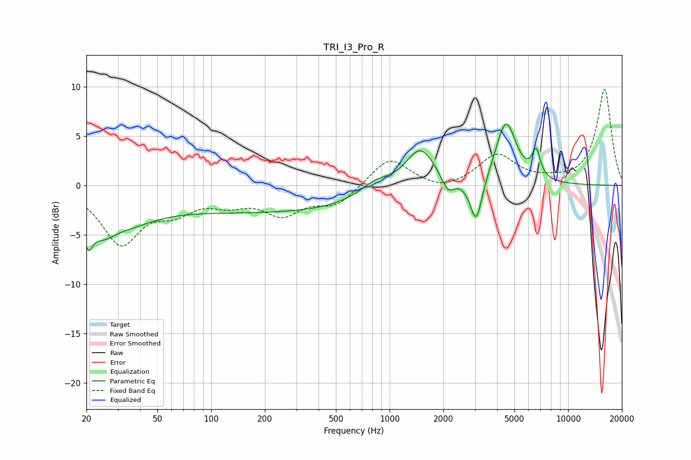

# TRI_I3_Pro_R
See [usage instructions](https://github.com/jaakkopasanen/AutoEq#usage) for more options and info.

### Parametric EQs
Apply preamp of -6.3 dB when using parametric equalizer.

|   # | Type    |   Fc (Hz) |    Q |   Gain (dB) |
|-----|---------|-----------|------|-------------|
|   1 | Peaking |        20 | 5.71 |        -2.9 |
|   2 | Peaking |        24 | 2.04 |        -2.1 |
|   3 | Peaking |        32 | 0.77 |        -2.8 |
|   4 | Peaking |       224 | 0.21 |        -2.7 |
|   5 | Peaking |       831 | 1.52 |         1.4 |
|   6 | Peaking |      1485 | 1.66 |         4.2 |
|   7 | Peaking |      2120 | 4.03 |        -1.6 |
|   8 | Peaking |      3054 | 4.18 |        -4.6 |
|   9 | Peaking |      4482 | 2.44 |         6.4 |
|  10 | Peaking |      6626 | 6    |         2.7 |

### Fixed Band EQs
When using fixed band (also called graphic) equalizer, apply preamp of **-9.8 dB** (if available) and set gains manually with these parameters.

|   # | Type    |   Fc (Hz) |    Q |   Gain (dB) |
|-----|---------|-----------|------|-------------|
|   1 | Peaking |        31 | 1.41 |        -5.7 |
|   2 | Peaking |        62 | 1.41 |        -2.1 |
|   3 | Peaking |       125 | 1.41 |        -1.4 |
|   4 | Peaking |       250 | 1.41 |        -2.6 |
|   5 | Peaking |       500 | 1.41 |        -1.9 |
|   6 | Peaking |      1000 | 1.41 |         2.9 |
|   7 | Peaking |      2000 | 1.41 |        -0.7 |
|   8 | Peaking |      4000 | 1.41 |         3.1 |
|   9 | Peaking |      8000 | 1.41 |         0.3 |
|  10 | Peaking |     16000 | 1.41 |         9.7 |

### Graphs

