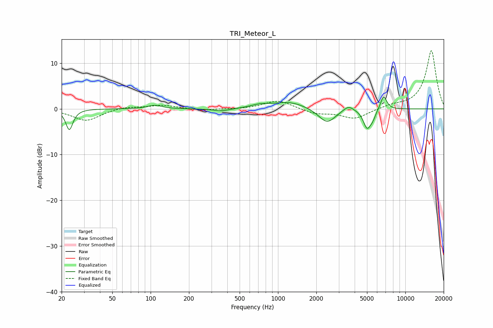

# TRI_Meteor_L
See [usage instructions](https://github.com/jaakkopasanen/AutoEq#usage) for more options and info.

### Parametric EQs
Apply preamp of -2.7 dB when using parametric equalizer.

|   # | Type    |   Fc (Hz) |    Q |   Gain (dB) |
|-----|---------|-----------|------|-------------|
|   1 | Peaking |        23 | 5.17 |        -4.5 |
|   2 | Peaking |       107 | 2.59 |         0.8 |
|   3 | Peaking |       360 | 1.99 |        -0.6 |
|   4 | Peaking |       724 | 1.97 |         0.7 |
|   5 | Peaking |      1235 | 1.12 |         1.5 |
|   6 | Peaking |      2428 | 2.12 |        -3.2 |
|   7 | Peaking |      3575 | 3.4  |         1.2 |
|   8 | Peaking |      5006 | 4.67 |        -4   |
|   9 | Peaking |      5539 | 6    |        -1.4 |
|  10 | Peaking |      6751 | 5.46 |         3.1 |

### Fixed Band EQs
When using fixed band (also called graphic) equalizer, apply preamp of **-12.8 dB** (if available) and set gains manually with these parameters.

|   # | Type    |   Fc (Hz) |    Q |   Gain (dB) |
|-----|---------|-----------|------|-------------|
|   1 | Peaking |        31 | 1.41 |        -2.6 |
|   2 | Peaking |        62 | 1.41 |         0.5 |
|   3 | Peaking |       125 | 1.41 |         0.8 |
|   4 | Peaking |       250 | 1.41 |        -0.3 |
|   5 | Peaking |       500 | 1.41 |        -0.1 |
|   6 | Peaking |      1000 | 1.41 |         1.9 |
|   7 | Peaking |      2000 | 1.41 |        -1   |
|   8 | Peaking |      4000 | 1.41 |        -2.1 |
|   9 | Peaking |      8000 | 1.41 |         0.7 |
|  10 | Peaking |     16000 | 1.41 |        12.8 |

### Graphs

