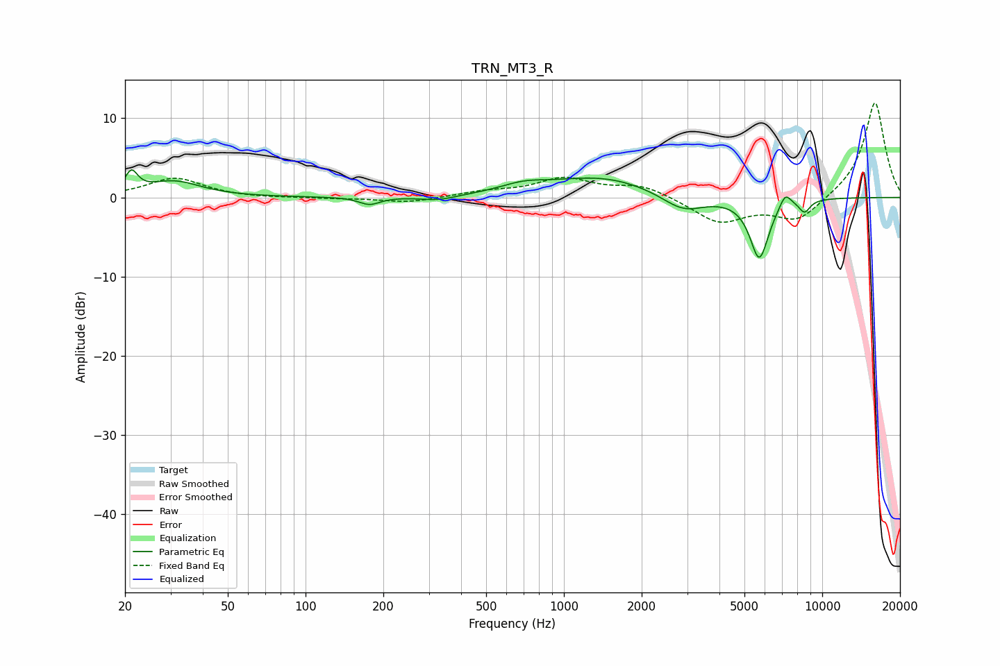

# TRN_MT3_R
See [usage instructions](https://github.com/jaakkopasanen/AutoEq#usage) for more options and info.

### Parametric EQs
Apply preamp of -3.6 dB when using parametric equalizer.

|   # | Type    |   Fc (Hz) |    Q |   Gain (dB) |
|-----|---------|-----------|------|-------------|
|   1 | Peaking |        21 | 5.95 |         2.5 |
|   2 | Peaking |        31 | 1.37 |         2   |
|   3 | Peaking |       177 | 3.49 |        -1   |
|   4 | Peaking |       327 | 1.99 |        -0.6 |
|   5 | Peaking |       698 | 1.57 |         1   |
|   6 | Peaking |      1398 | 0.7  |         2.5 |
|   7 | Peaking |      2896 | 1.68 |        -2.2 |
|   8 | Peaking |      5707 | 3.72 |        -7.7 |
|   9 | Peaking |      7192 | 5.99 |         1.8 |
|  10 | Peaking |      8539 | 5.99 |        -1.5 |

### Fixed Band EQs
When using fixed band (also called graphic) equalizer, apply preamp of **-12.0 dB** (if available) and set gains manually with these parameters.

|   # | Type    |   Fc (Hz) |    Q |   Gain (dB) |
|-----|---------|-----------|------|-------------|
|   1 | Peaking |        31 | 1.41 |         2.4 |
|   2 | Peaking |        62 | 1.41 |        -0.1 |
|   3 | Peaking |       125 | 1.41 |        -0.1 |
|   4 | Peaking |       250 | 1.41 |        -0.7 |
|   5 | Peaking |       500 | 1.41 |         0.6 |
|   6 | Peaking |      1000 | 1.41 |         2.3 |
|   7 | Peaking |      2000 | 1.41 |         1.5 |
|   8 | Peaking |      4000 | 1.41 |        -3.2 |
|   9 | Peaking |      8000 | 1.41 |        -3   |
|  10 | Peaking |     16000 | 1.41 |        12.2 |

### Graphs

