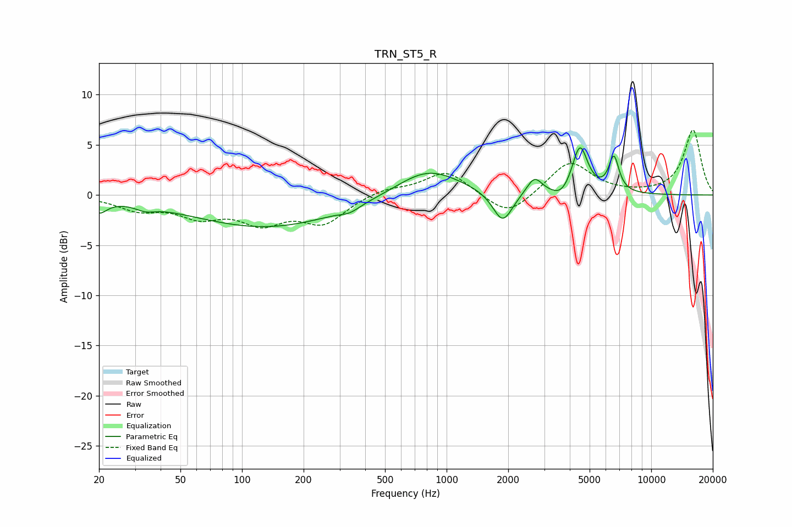

# TRN_ST5_R
See [usage instructions](https://github.com/jaakkopasanen/AutoEq#usage) for more options and info.

### Parametric EQs
Apply preamp of -4.8 dB when using parametric equalizer.

|   # | Type    |   Fc (Hz) |    Q |   Gain (dB) |
|-----|---------|-----------|------|-------------|
|   1 | Peaking |        20 | 3.64 |        -1.3 |
|   2 | Peaking |        34 | 3.05 |        -0.5 |
|   3 | Peaking |       132 | 0.38 |        -3.2 |
|   4 | Peaking |       336 | 3.02 |        -0.5 |
|   5 | Peaking |       812 | 0.91 |         2.8 |
|   6 | Peaking |      1880 | 2.93 |        -3.2 |
|   7 | Peaking |      2688 | 3.77 |         1.7 |
|   8 | Peaking |      3653 | 3.09 |        -1   |
|   9 | Peaking |      4483 | 3.72 |         4.8 |
|  10 | Peaking |      6569 | 5.47 |         3.5 |

### Fixed Band EQs
When using fixed band (also called graphic) equalizer, apply preamp of **-6.6 dB** (if available) and set gains manually with these parameters.

|   # | Type    |   Fc (Hz) |    Q |   Gain (dB) |
|-----|---------|-----------|------|-------------|
|   1 | Peaking |        31 | 1.41 |        -1.3 |
|   2 | Peaking |        62 | 1.41 |        -1.9 |
|   3 | Peaking |       125 | 1.41 |        -2.5 |
|   4 | Peaking |       250 | 1.41 |        -2.6 |
|   5 | Peaking |       500 | 1.41 |         0.7 |
|   6 | Peaking |      1000 | 1.41 |         2.4 |
|   7 | Peaking |      2000 | 1.41 |        -2.3 |
|   8 | Peaking |      4000 | 1.41 |         3.4 |
|   9 | Peaking |      8000 | 1.41 |         0   |
|  10 | Peaking |     16000 | 1.41 |         6.5 |

### Graphs

