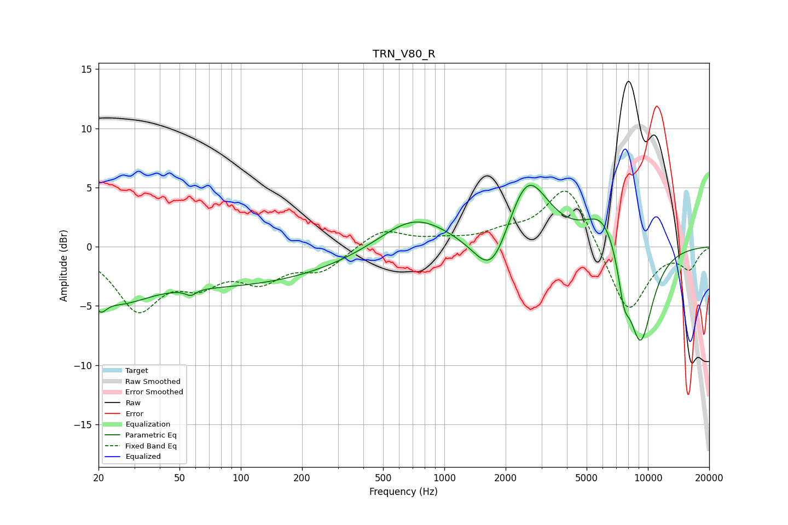

# TRN_V80_R
See [usage instructions](https://github.com/jaakkopasanen/AutoEq#usage) for more options and info.

### Parametric EQs
Apply preamp of -5.3 dB when using parametric equalizer.

|   # | Type    |   Fc (Hz) |    Q |   Gain (dB) |
|-----|---------|-----------|------|-------------|
|   1 | Peaking |        20 | 4.37 |        -1.7 |
|   2 | Peaking |        25 | 1    |        -2.5 |
|   3 | Peaking |        57 | 5.78 |        -0.5 |
|   4 | Peaking |        84 | 0.24 |        -3.2 |
|   5 | Peaking |       708 | 0.84 |         2.8 |
|   6 | Peaking |      1715 | 1.6  |        -4.4 |
|   7 | Peaking |      2546 | 1.37 |         6.3 |
|   8 | Peaking |      6039 | 1.55 |         3.3 |
|   9 | Peaking |      7620 | 4.77 |        -2.8 |
|  10 | Peaking |      9171 | 1.93 |        -8.5 |

### Fixed Band EQs
When using fixed band (also called graphic) equalizer, apply preamp of **-4.8 dB** (if available) and set gains manually with these parameters.

|   # | Type    |   Fc (Hz) |    Q |   Gain (dB) |
|-----|---------|-----------|------|-------------|
|   1 | Peaking |        31 | 1.41 |        -5   |
|   2 | Peaking |        62 | 1.41 |        -2.4 |
|   3 | Peaking |       125 | 1.41 |        -2.5 |
|   4 | Peaking |       250 | 1.41 |        -1.8 |
|   5 | Peaking |       500 | 1.41 |         1.5 |
|   6 | Peaking |      1000 | 1.41 |         0.4 |
|   7 | Peaking |      2000 | 1.41 |         0.9 |
|   8 | Peaking |      4000 | 1.41 |         5.4 |
|   9 | Peaking |      8000 | 1.41 |        -5.8 |
|  10 | Peaking |     16000 | 1.41 |        -1.7 |

### Graphs

