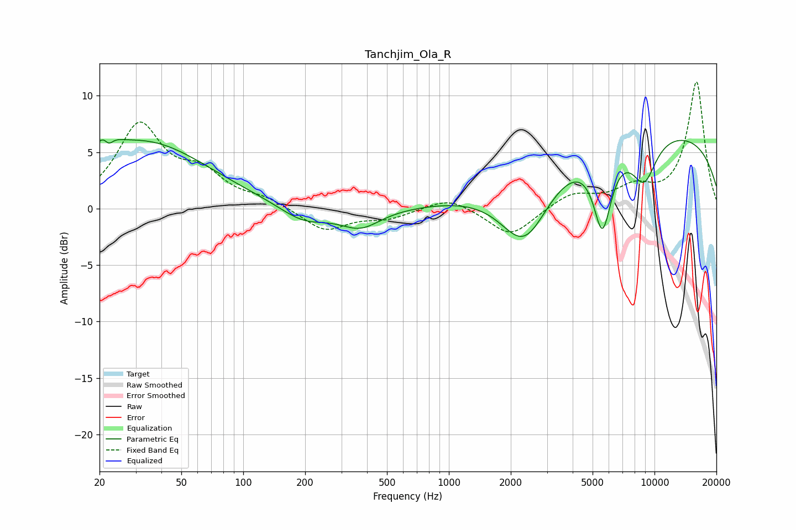

# Tanchjim_Ola_R
See [usage instructions](https://github.com/jaakkopasanen/AutoEq#usage) for more options and info.

### Parametric EQs
Apply preamp of -6.2 dB when using parametric equalizer.

|   # | Type    |   Fc (Hz) |    Q |   Gain (dB) |
|-----|---------|-----------|------|-------------|
|   1 | Peaking |        20 | 1.53 |         0.8 |
|   2 | Peaking |        22 | 4.4  |         3.6 |
|   3 | Peaking |        22 | 5.37 |        -3.4 |
|   4 | Peaking |        34 | 0.47 |         5.7 |
|   5 | Peaking |       196 | 1.2  |        -1.5 |
|   6 | Peaking |       371 | 1.43 |        -1.7 |
|   7 | Peaking |      2337 | 1.14 |        -6.6 |
|   8 | Peaking |      5583 | 3.13 |        -6.9 |
|   9 | Peaking |      8898 | 2.1  |        -3.9 |
|  10 | Peaking |      8960 | 0.18 |         7.1 |

### Fixed Band EQs
When using fixed band (also called graphic) equalizer, apply preamp of **-11.3 dB** (if available) and set gains manually with these parameters.

|   # | Type    |   Fc (Hz) |    Q |   Gain (dB) |
|-----|---------|-----------|------|-------------|
|   1 | Peaking |        31 | 1.41 |         7.2 |
|   2 | Peaking |        62 | 1.41 |         2.6 |
|   3 | Peaking |       125 | 1.41 |         0.7 |
|   4 | Peaking |       250 | 1.41 |        -2   |
|   5 | Peaking |       500 | 1.41 |        -0.8 |
|   6 | Peaking |      1000 | 1.41 |         1.1 |
|   7 | Peaking |      2000 | 1.41 |        -2.5 |
|   8 | Peaking |      4000 | 1.41 |         1.3 |
|   9 | Peaking |      8000 | 1.41 |         1.6 |
|  10 | Peaking |     16000 | 1.41 |        11.2 |

### Graphs

