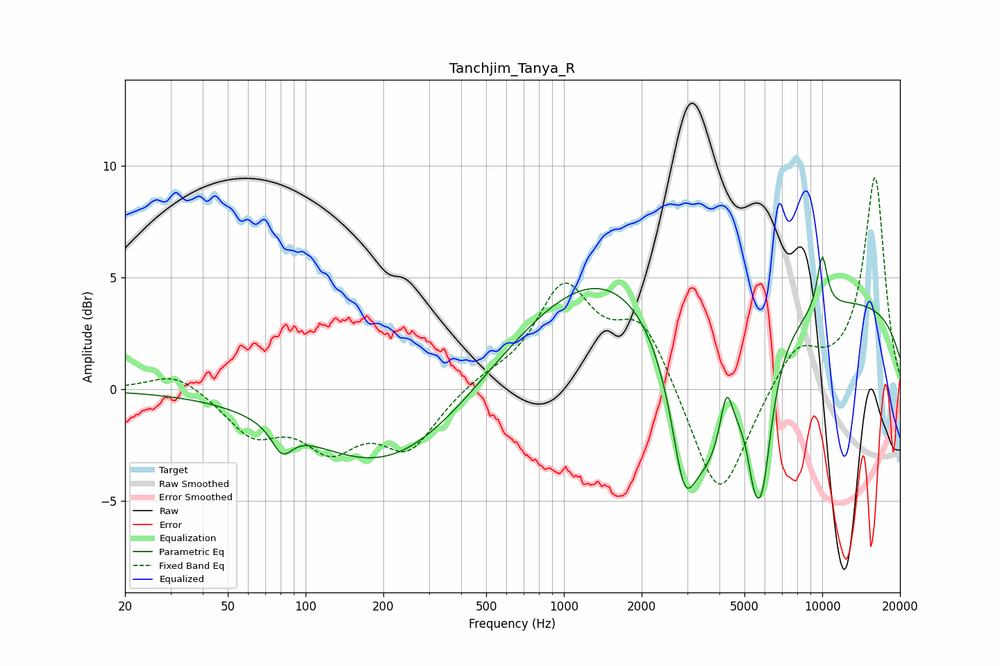

# Tanchjim_Tanya_R
See [usage instructions](https://github.com/jaakkopasanen/AutoEq#usage) for more options and info.

### Parametric EQs
Apply preamp of -6.0 dB when using parametric equalizer.

|   # | Type    |   Fc (Hz) |    Q |   Gain (dB) |
|-----|---------|-----------|------|-------------|
|   1 | Peaking |        81 | 3.62 |        -1.2 |
|   2 | Peaking |       209 | 0.46 |        -3.6 |
|   3 | Peaking |      1641 | 0.36 |         5.7 |
|   4 | Peaking |      2914 | 3.18 |        -3.8 |
|   5 | Peaking |      3586 | 0.94 |        -9.2 |
|   6 | Peaking |      4258 | 5.74 |         2.4 |
|   7 | Peaking |      5416 | 5.89 |        -1.5 |
|   8 | Peaking |      5835 | 3.58 |        -5.5 |
|   9 | Peaking |     10000 | 0.18 |         4.1 |
|  10 | Peaking |     10000 | 6    |         2.5 |

### Fixed Band EQs
When using fixed band (also called graphic) equalizer, apply preamp of **-9.6 dB** (if available) and set gains manually with these parameters.

|   # | Type    |   Fc (Hz) |    Q |   Gain (dB) |
|-----|---------|-----------|------|-------------|
|   1 | Peaking |        31 | 1.41 |         0.9 |
|   2 | Peaking |        62 | 1.41 |        -1.9 |
|   3 | Peaking |       125 | 1.41 |        -2.3 |
|   4 | Peaking |       250 | 1.41 |        -2.5 |
|   5 | Peaking |       500 | 1.41 |         0.4 |
|   6 | Peaking |      1000 | 1.41 |         4.4 |
|   7 | Peaking |      2000 | 1.41 |         3   |
|   8 | Peaking |      4000 | 1.41 |        -5.3 |
|   9 | Peaking |      8000 | 1.41 |         1.9 |
|  10 | Peaking |     16000 | 1.41 |         9.5 |

### Graphs

