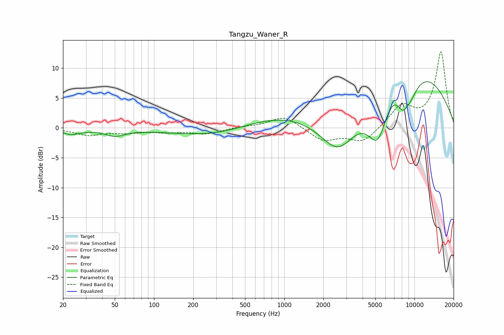

# Tangzu_Waner_R
See [usage instructions](https://github.com/jaakkopasanen/AutoEq#usage) for more options and info.

### Parametric EQs
Apply preamp of -7.8 dB when using parametric equalizer.

|   # | Type    |   Fc (Hz) |    Q |   Gain (dB) |
|-----|---------|-----------|------|-------------|
|   1 | Peaking |        23 | 1.91 |        -1   |
|   2 | Peaking |        50 | 1.81 |        -1.2 |
|   3 | Peaking |       288 | 0.42 |        -1.5 |
|   4 | Peaking |       342 | 0.89 |        -0.2 |
|   5 | Peaking |      2429 | 0.21 |         4.2 |
|   6 | Peaking |      2626 | 0.72 |       -12.3 |
|   7 | Peaking |      5249 | 1.4  |       -11.7 |
|   8 | Peaking |      7499 | 0.44 |        19.4 |
|   9 | Peaking |      8499 | 1.5  |       -15.6 |
|  10 | Peaking |      8637 | 3.92 |         3.1 |

### Fixed Band EQs
When using fixed band (also called graphic) equalizer, apply preamp of **-12.8 dB** (if available) and set gains manually with these parameters.

|   # | Type    |   Fc (Hz) |    Q |   Gain (dB) |
|-----|---------|-----------|------|-------------|
|   1 | Peaking |        31 | 1.41 |        -1.2 |
|   2 | Peaking |        62 | 1.41 |        -0.7 |
|   3 | Peaking |       125 | 1.41 |        -0.6 |
|   4 | Peaking |       250 | 1.41 |        -1   |
|   5 | Peaking |       500 | 1.41 |         0.2 |
|   6 | Peaking |      1000 | 1.41 |         2   |
|   7 | Peaking |      2000 | 1.41 |        -2.1 |
|   8 | Peaking |      4000 | 1.41 |        -2.4 |
|   9 | Peaking |      8000 | 1.41 |         3.6 |
|  10 | Peaking |     16000 | 1.41 |        12.7 |

### Graphs

