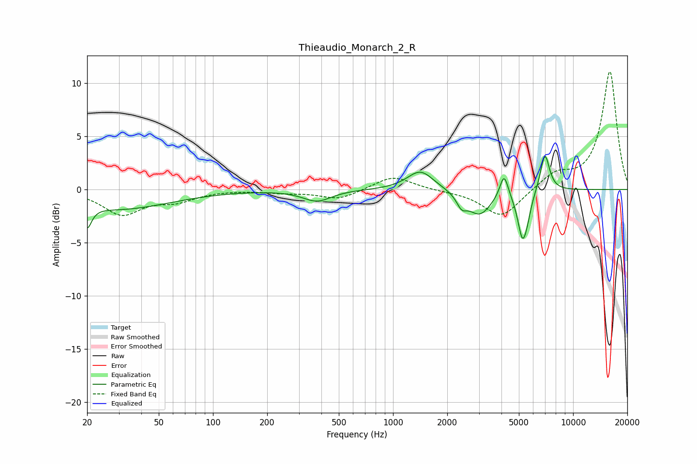

# Thieaudio_Monarch_2_R
See [usage instructions](https://github.com/jaakkopasanen/AutoEq#usage) for more options and info.

### Parametric EQs
Apply preamp of -3.2 dB when using parametric equalizer.

|   # | Type    |   Fc (Hz) |    Q |   Gain (dB) |
|-----|---------|-----------|------|-------------|
|   1 | Peaking |        20 | 5.89 |        -2.1 |
|   2 | Peaking |        30 | 0.49 |        -1.8 |
|   3 | Peaking |       378 | 1.79 |        -1.1 |
|   4 | Peaking |      1419 | 1.94 |         1.9 |
|   5 | Peaking |      2405 | 5.1  |        -1.1 |
|   6 | Peaking |      3025 | 2.15 |        -2.3 |
|   7 | Peaking |      4135 | 6    |         2.3 |
|   8 | Peaking |      5236 | 5.19 |        -4.2 |
|   9 | Peaking |      5577 | 6    |        -1   |
|  10 | Peaking |      6972 | 5.3  |         3.6 |

### Fixed Band EQs
When using fixed band (also called graphic) equalizer, apply preamp of **-11.2 dB** (if available) and set gains manually with these parameters.

|   # | Type    |   Fc (Hz) |    Q |   Gain (dB) |
|-----|---------|-----------|------|-------------|
|   1 | Peaking |        31 | 1.41 |        -2.3 |
|   2 | Peaking |        62 | 1.41 |        -0.9 |
|   3 | Peaking |       125 | 1.41 |         0   |
|   4 | Peaking |       250 | 1.41 |        -0.2 |
|   5 | Peaking |       500 | 1.41 |        -0.9 |
|   6 | Peaking |      1000 | 1.41 |         1.3 |
|   7 | Peaking |      2000 | 1.41 |        -0.1 |
|   8 | Peaking |      4000 | 1.41 |        -2.7 |
|   9 | Peaking |      8000 | 1.41 |         1.4 |
|  10 | Peaking |     16000 | 1.41 |        11.1 |

### Graphs

