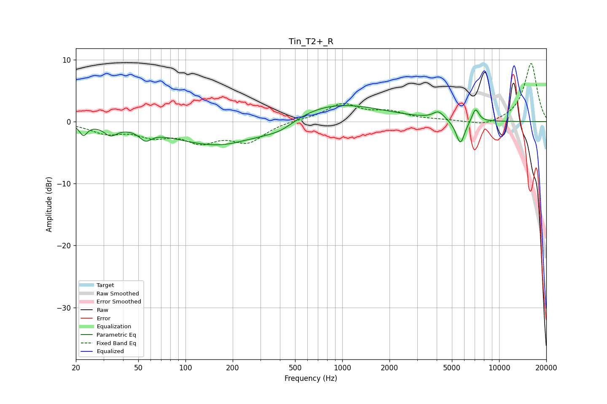

# Tin_T2+_R
See [usage instructions](https://github.com/jaakkopasanen/AutoEq#usage) for more options and info.

### Parametric EQs
Apply preamp of -2.7 dB when using parametric equalizer.

|   # | Type    |   Fc (Hz) |    Q |   Gain (dB) |
|-----|---------|-----------|------|-------------|
|   1 | Peaking |        22 | 5.93 |        -1.7 |
|   2 | Peaking |        33 | 3.5  |        -1.5 |
|   3 | Peaking |        56 | 3.8  |        -1.5 |
|   4 | Peaking |       185 | 0.44 |        -4.4 |
|   5 | Peaking |       228 | 2.28 |         0.2 |
|   6 | Peaking |       404 | 1.51 |        -1.2 |
|   7 | Peaking |       786 | 0.43 |         3.6 |
|   8 | Peaking |      4107 | 4.04 |         1.3 |
|   9 | Peaking |      5663 | 4.88 |        -3.9 |
|  10 | Peaking |      7070 | 5.99 |         2.2 |

### Fixed Band EQs
When using fixed band (also called graphic) equalizer, apply preamp of **-9.5 dB** (if available) and set gains manually with these parameters.

|   # | Type    |   Fc (Hz) |    Q |   Gain (dB) |
|-----|---------|-----------|------|-------------|
|   1 | Peaking |        31 | 1.41 |        -1.7 |
|   2 | Peaking |        62 | 1.41 |        -1.9 |
|   3 | Peaking |       125 | 1.41 |        -2.8 |
|   4 | Peaking |       250 | 1.41 |        -3   |
|   5 | Peaking |       500 | 1.41 |         0.2 |
|   6 | Peaking |      1000 | 1.41 |         2.7 |
|   7 | Peaking |      2000 | 1.41 |         1.3 |
|   8 | Peaking |      4000 | 1.41 |         0.2 |
|   9 | Peaking |      8000 | 1.41 |        -0.8 |
|  10 | Peaking |     16000 | 1.41 |         9.5 |

### Graphs

