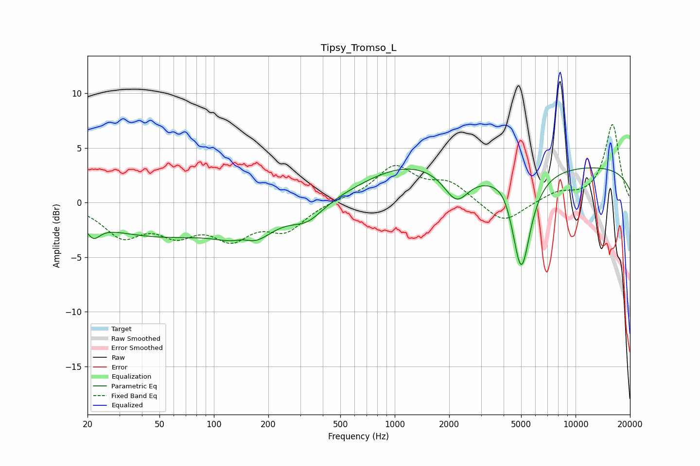

# Tipsy_Tromso_L
See [usage instructions](https://github.com/jaakkopasanen/AutoEq#usage) for more options and info.

### Parametric EQs
Apply preamp of -3.3 dB when using parametric equalizer.

|   # | Type    |   Fc (Hz) |    Q |   Gain (dB) |
|-----|---------|-----------|------|-------------|
|   1 | Peaking |        22 | 3.92 |        -1.3 |
|   2 | Peaking |        49 | 0.38 |        -2.9 |
|   3 | Peaking |       145 | 2.32 |         1.2 |
|   4 | Peaking |       154 | 1.21 |        -3.2 |
|   5 | Peaking |       329 | 1.59 |        -1.5 |
|   6 | Peaking |      1131 | 0.56 |         2.8 |
|   7 | Peaking |      2196 | 2.06 |        -2.7 |
|   8 | Peaking |      4052 | 2.88 |         0.7 |
|   9 | Peaking |      5009 | 2.71 |        -9.2 |
|  10 | Peaking |     10000 | 0.18 |         3.4 |

### Fixed Band EQs
When using fixed band (also called graphic) equalizer, apply preamp of **-7.2 dB** (if available) and set gains manually with these parameters.

|   # | Type    |   Fc (Hz) |    Q |   Gain (dB) |
|-----|---------|-----------|------|-------------|
|   1 | Peaking |        31 | 1.41 |        -2.8 |
|   2 | Peaking |        62 | 1.41 |        -2.4 |
|   3 | Peaking |       125 | 1.41 |        -2.8 |
|   4 | Peaking |       250 | 1.41 |        -2.3 |
|   5 | Peaking |       500 | 1.41 |         0.2 |
|   6 | Peaking |      1000 | 1.41 |         3.2 |
|   7 | Peaking |      2000 | 1.41 |         1.7 |
|   8 | Peaking |      4000 | 1.41 |        -2   |
|   9 | Peaking |      8000 | 1.41 |         0.9 |
|  10 | Peaking |     16000 | 1.41 |         7.1 |

### Graphs

