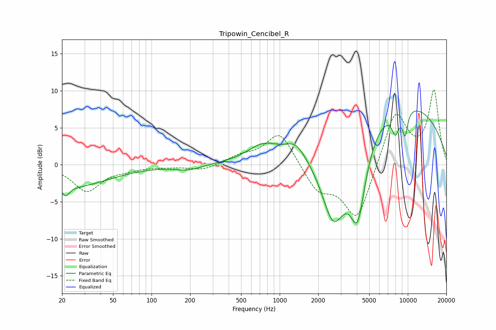

# Tripowin_Cencibel_R
See [usage instructions](https://github.com/jaakkopasanen/AutoEq#usage) for more options and info.

### Parametric EQs
Apply preamp of -7.3 dB when using parametric equalizer.

|   # | Type    |   Fc (Hz) |    Q |   Gain (dB) |
|-----|---------|-----------|------|-------------|
|   1 | Peaking |        21 | 5.42 |        -1.2 |
|   2 | Peaking |        23 | 0.46 |        -3   |
|   3 | Peaking |       194 | 1.37 |        -0.7 |
|   4 | Peaking |       740 | 1.21 |         1.9 |
|   5 | Peaking |      1337 | 1.89 |         1.8 |
|   6 | Peaking |      2626 | 1.24 |       -12.4 |
|   7 | Peaking |      4058 | 2.14 |       -10.7 |
|   8 | Peaking |      6984 | 0.22 |         9.2 |
|   9 | Peaking |      8006 | 4.55 |        -2.9 |
|  10 | Peaking |      9519 | 5.99 |        -3.4 |

### Fixed Band EQs
When using fixed band (also called graphic) equalizer, apply preamp of **-10.2 dB** (if available) and set gains manually with these parameters.

|   # | Type    |   Fc (Hz) |    Q |   Gain (dB) |
|-----|---------|-----------|------|-------------|
|   1 | Peaking |        31 | 1.41 |        -3.5 |
|   2 | Peaking |        62 | 1.41 |        -0.5 |
|   3 | Peaking |       125 | 1.41 |        -0.2 |
|   4 | Peaking |       250 | 1.41 |        -0.8 |
|   5 | Peaking |       500 | 1.41 |         1   |
|   6 | Peaking |      1000 | 1.41 |         4.6 |
|   7 | Peaking |      2000 | 1.41 |        -3.3 |
|   8 | Peaking |      4000 | 1.41 |        -7.6 |
|   9 | Peaking |      8000 | 1.41 |         7.4 |
|  10 | Peaking |     16000 | 1.41 |         9.9 |

### Graphs

