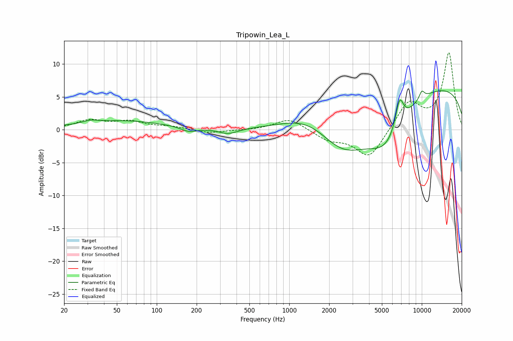

# Tripowin_Lea_L
See [usage instructions](https://github.com/jaakkopasanen/AutoEq#usage) for more options and info.

### Parametric EQs
Apply preamp of -6.0 dB when using parametric equalizer.

|   # | Type    |   Fc (Hz) |    Q |   Gain (dB) |
|-----|---------|-----------|------|-------------|
|   1 | Peaking |        32 | 2.77 |         0.4 |
|   2 | Peaking |        55 | 0.43 |         1.4 |
|   3 | Peaking |       175 | 2.33 |        -0.7 |
|   4 | Peaking |       346 | 1.97 |        -0.9 |
|   5 | Peaking |      1430 | 0.7  |         2.9 |
|   6 | Peaking |      2560 | 0.66 |        -7   |
|   7 | Peaking |      5431 | 0.93 |        -6.4 |
|   8 | Peaking |      6786 | 4.27 |         4.5 |
|   9 | Peaking |     10000 | 6    |         1.2 |
|  10 | Peaking |     10000 | 0.18 |         7   |

### Fixed Band EQs
When using fixed band (also called graphic) equalizer, apply preamp of **-11.8 dB** (if available) and set gains manually with these parameters.

|   # | Type    |   Fc (Hz) |    Q |   Gain (dB) |
|-----|---------|-----------|------|-------------|
|   1 | Peaking |        31 | 1.41 |         1.4 |
|   2 | Peaking |        62 | 1.41 |         1.1 |
|   3 | Peaking |       125 | 1.41 |         0.4 |
|   4 | Peaking |       250 | 1.41 |        -0.5 |
|   5 | Peaking |       500 | 1.41 |        -0.1 |
|   6 | Peaking |      1000 | 1.41 |         1.8 |
|   7 | Peaking |      2000 | 1.41 |        -1.4 |
|   8 | Peaking |      4000 | 1.41 |        -4.4 |
|   9 | Peaking |      8000 | 1.41 |         4.2 |
|  10 | Peaking |     16000 | 1.41 |        11.6 |

### Graphs

