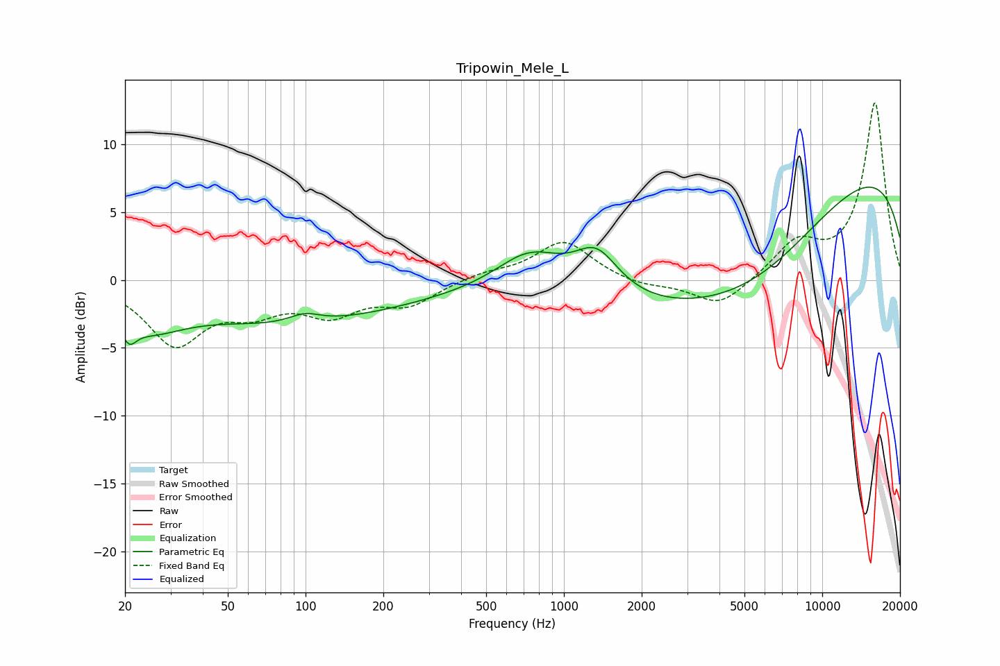

# Tripowin_Mele_L
See [usage instructions](https://github.com/jaakkopasanen/AutoEq#usage) for more options and info.

### Parametric EQs
Apply preamp of -6.9 dB when using parametric equalizer.

|   # | Type    |   Fc (Hz) |    Q |   Gain (dB) |
|-----|---------|-----------|------|-------------|
|   1 | Peaking |        21 | 5.49 |        -1.2 |
|   2 | Peaking |        24 | 0.93 |        -2.8 |
|   3 | Peaking |        76 | 0.43 |        -1.5 |
|   4 | Peaking |        99 | 2.33 |         0.7 |
|   5 | Peaking |       130 | 0.3  |        -1.7 |
|   6 | Peaking |       738 | 1.1  |         2.7 |
|   7 | Peaking |      1338 | 1.65 |         3.1 |
|   8 | Peaking |      2744 | 0.41 |        -4.6 |
|   9 | Peaking |      5776 | 0.46 |        -5.3 |
|  10 | Peaking |      9892 | 0.18 |         9.3 |

### Fixed Band EQs
When using fixed band (also called graphic) equalizer, apply preamp of **-13.1 dB** (if available) and set gains manually with these parameters.

|   # | Type    |   Fc (Hz) |    Q |   Gain (dB) |
|-----|---------|-----------|------|-------------|
|   1 | Peaking |        31 | 1.41 |        -4.6 |
|   2 | Peaking |        62 | 1.41 |        -1.8 |
|   3 | Peaking |       125 | 1.41 |        -2.2 |
|   4 | Peaking |       250 | 1.41 |        -1.7 |
|   5 | Peaking |       500 | 1.41 |         0.5 |
|   6 | Peaking |      1000 | 1.41 |         2.9 |
|   7 | Peaking |      2000 | 1.41 |        -0.5 |
|   8 | Peaking |      4000 | 1.41 |        -2   |
|   9 | Peaking |      8000 | 1.41 |         2.6 |
|  10 | Peaking |     16000 | 1.41 |        13   |

### Graphs

