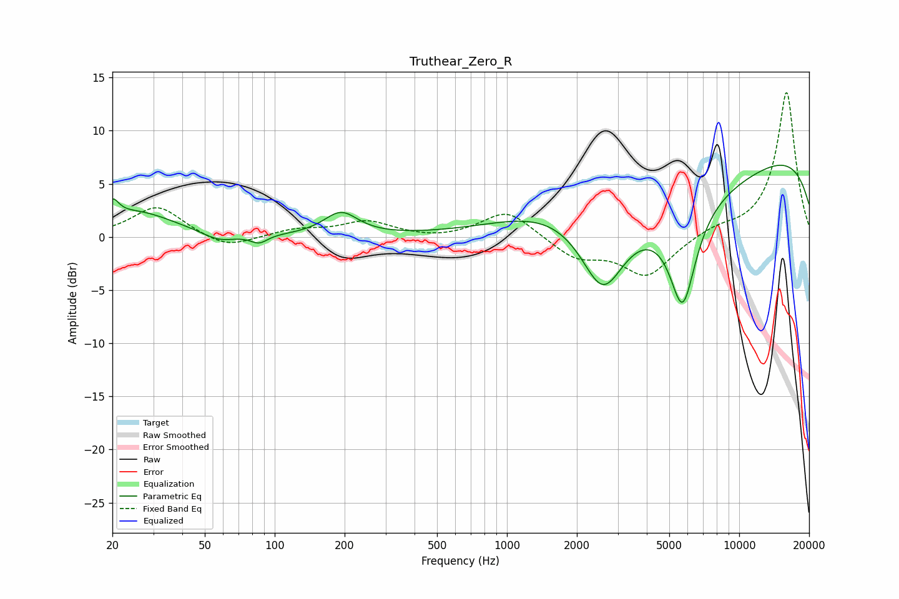

# Truthear_Zero_R
See [usage instructions](https://github.com/jaakkopasanen/AutoEq#usage) for more options and info.

### Parametric EQs
Apply preamp of -6.8 dB when using parametric equalizer.

|   # | Type    |   Fc (Hz) |    Q |   Gain (dB) |
|-----|---------|-----------|------|-------------|
|   1 | Peaking |        20 | 5.39 |         1.6 |
|   2 | Peaking |        25 | 0.87 |         2.3 |
|   3 | Peaking |        58 | 1.98 |        -0.9 |
|   4 | Peaking |        86 | 3.89 |        -0.8 |
|   5 | Peaking |       193 | 1.94 |         2.2 |
|   6 | Peaking |      1595 | 0.51 |         3.7 |
|   7 | Peaking |      2587 | 1.46 |        -7.4 |
|   8 | Peaking |      4090 | 0.26 |        -5.8 |
|   9 | Peaking |      5711 | 2.35 |        -9.5 |
|  10 | Peaking |      9701 | 0.18 |         9.6 |

### Fixed Band EQs
When using fixed band (also called graphic) equalizer, apply preamp of **-13.7 dB** (if available) and set gains manually with these parameters.

|   # | Type    |   Fc (Hz) |    Q |   Gain (dB) |
|-----|---------|-----------|------|-------------|
|   1 | Peaking |        31 | 1.41 |         2.9 |
|   2 | Peaking |        62 | 1.41 |        -1.2 |
|   3 | Peaking |       125 | 1.41 |         0.7 |
|   4 | Peaking |       250 | 1.41 |         1.4 |
|   5 | Peaking |       500 | 1.41 |        -0.3 |
|   6 | Peaking |      1000 | 1.41 |         2.6 |
|   7 | Peaking |      2000 | 1.41 |        -1.9 |
|   8 | Peaking |      4000 | 1.41 |        -3.6 |
|   9 | Peaking |      8000 | 1.41 |         0.7 |
|  10 | Peaking |     16000 | 1.41 |        13.7 |

### Graphs

