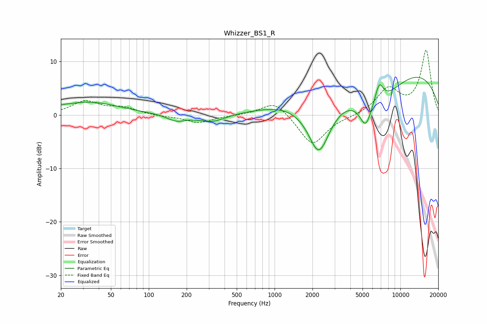

# Whizzer_BS1_R
See [usage instructions](https://github.com/jaakkopasanen/AutoEq#usage) for more options and info.

### Parametric EQs
Apply preamp of -7.1 dB when using parametric equalizer.

|   # | Type    |   Fc (Hz) |    Q |   Gain (dB) |
|-----|---------|-----------|------|-------------|
|   1 | Peaking |        21 | 5.28 |         0.1 |
|   2 | Peaking |        33 | 0.57 |         2.4 |
|   3 | Peaking |       166 | 1.9  |        -1.2 |
|   4 | Peaking |       317 | 1.33 |        -1.4 |
|   5 | Peaking |      2089 | 3.8  |        -0.2 |
|   6 | Peaking |      2261 | 1.38 |       -11.8 |
|   7 | Peaking |      5286 | 3.1  |        -4.3 |
|   8 | Peaking |      6380 | 0.63 |        -7.7 |
|   9 | Peaking |      6780 | 3.97 |         4   |
|  10 | Peaking |      7388 | 0.2  |        11.2 |

### Fixed Band EQs
When using fixed band (also called graphic) equalizer, apply preamp of **-12.2 dB** (if available) and set gains manually with these parameters.

|   # | Type    |   Fc (Hz) |    Q |   Gain (dB) |
|-----|---------|-----------|------|-------------|
|   1 | Peaking |        31 | 1.41 |         2.5 |
|   2 | Peaking |        62 | 1.41 |         1.2 |
|   3 | Peaking |       125 | 1.41 |        -0.2 |
|   4 | Peaking |       250 | 1.41 |        -1.5 |
|   5 | Peaking |       500 | 1.41 |        -0.1 |
|   6 | Peaking |      1000 | 1.41 |         2.8 |
|   7 | Peaking |      2000 | 1.41 |        -5.8 |
|   8 | Peaking |      4000 | 1.41 |        -0.2 |
|   9 | Peaking |      8000 | 1.41 |         4.7 |
|  10 | Peaking |     16000 | 1.41 |        12   |

### Graphs

