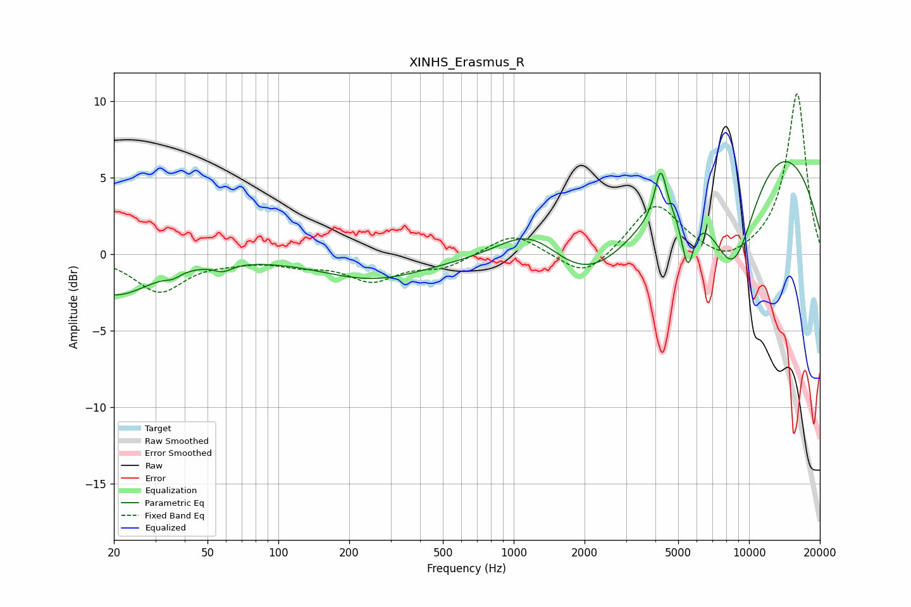

# XINHS_Erasmus_R
See [usage instructions](https://github.com/jaakkopasanen/AutoEq#usage) for more options and info.

### Parametric EQs
Apply preamp of -6.1 dB when using parametric equalizer.

|   # | Type    |   Fc (Hz) |    Q |   Gain (dB) |
|-----|---------|-----------|------|-------------|
|   1 | Peaking |        20 | 0.87 |        -2.6 |
|   2 | Peaking |        36 | 4.75 |        -0.3 |
|   3 | Peaking |        58 | 3.59 |        -0.5 |
|   4 | Peaking |       252 | 0.63 |        -1.6 |
|   5 | Peaking |      1192 | 0.94 |         3.2 |
|   6 | Peaking |      2128 | 0.55 |        -5.7 |
|   7 | Peaking |      4211 | 5.93 |         3.1 |
|   8 | Peaking |      5488 | 5.01 |        -3.8 |
|   9 | Peaking |      8544 | 0.93 |       -12.2 |
|  10 | Peaking |      8835 | 0.31 |        12.9 |

### Fixed Band EQs
When using fixed band (also called graphic) equalizer, apply preamp of **-10.6 dB** (if available) and set gains manually with these parameters.

|   # | Type    |   Fc (Hz) |    Q |   Gain (dB) |
|-----|---------|-----------|------|-------------|
|   1 | Peaking |        31 | 1.41 |        -2.4 |
|   2 | Peaking |        62 | 1.41 |        -0.3 |
|   3 | Peaking |       125 | 1.41 |        -0.5 |
|   4 | Peaking |       250 | 1.41 |        -1.6 |
|   5 | Peaking |       500 | 1.41 |        -0.8 |
|   6 | Peaking |      1000 | 1.41 |         1.4 |
|   7 | Peaking |      2000 | 1.41 |        -1.7 |
|   8 | Peaking |      4000 | 1.41 |         3.4 |
|   9 | Peaking |      8000 | 1.41 |        -0.9 |
|  10 | Peaking |     16000 | 1.41 |        10.5 |

### Graphs

