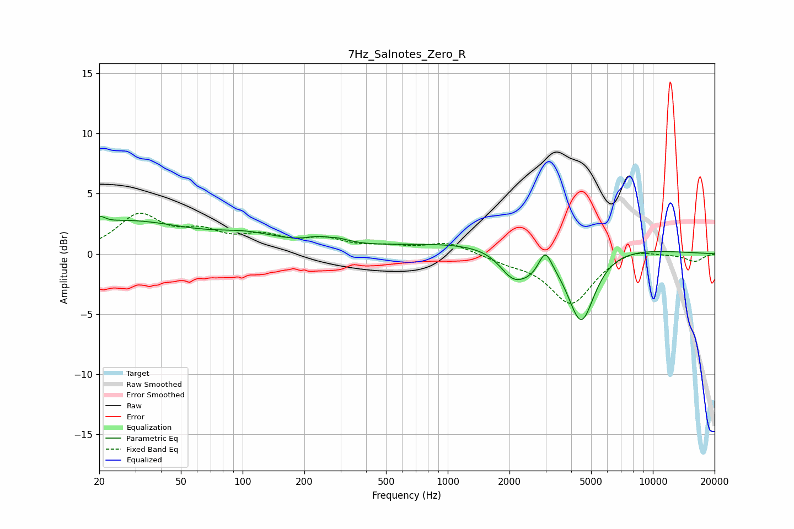

# 7Hz_Salnotes_Zero_R
See [usage instructions](https://github.com/jaakkopasanen/AutoEq#usage) for more options and info.

### Parametric EQs
Apply preamp of -3.2 dB when using parametric equalizer.

|   # | Type    |   Fc (Hz) |    Q |   Gain (dB) |
|-----|---------|-----------|------|-------------|
|   1 | Peaking |        20 | 5.97 |         0.6 |
|   2 | Peaking |        26 | 0.45 |         2.6 |
|   3 | Peaking |       107 | 0.84 |         1.1 |
|   4 | Peaking |       259 | 2.1  |         1.5 |
|   5 | Peaking |       260 | 3.03 |        -0.8 |
|   6 | Peaking |      2075 | 2.12 |        -2.2 |
|   7 | Peaking |      2143 | 0.2  |         1   |
|   8 | Peaking |      2526 | 2.35 |        -1.1 |
|   9 | Peaking |      2988 | 4.81 |         1.6 |
|  10 | Peaking |      4471 | 2.1  |        -6.2 |

### Fixed Band EQs
When using fixed band (also called graphic) equalizer, apply preamp of **-3.5 dB** (if available) and set gains manually with these parameters.

|   # | Type    |   Fc (Hz) |    Q |   Gain (dB) |
|-----|---------|-----------|------|-------------|
|   1 | Peaking |        31 | 1.41 |         3   |
|   2 | Peaking |        62 | 1.41 |         1.5 |
|   3 | Peaking |       125 | 1.41 |         1.2 |
|   4 | Peaking |       250 | 1.41 |         1   |
|   5 | Peaking |       500 | 1.41 |         0.5 |
|   6 | Peaking |      1000 | 1.41 |         0.9 |
|   7 | Peaking |      2000 | 1.41 |        -0.5 |
|   8 | Peaking |      4000 | 1.41 |        -4.1 |
|   9 | Peaking |      8000 | 1.41 |         0.6 |
|  10 | Peaking |     16000 | 1.41 |        -0.6 |

### Graphs

