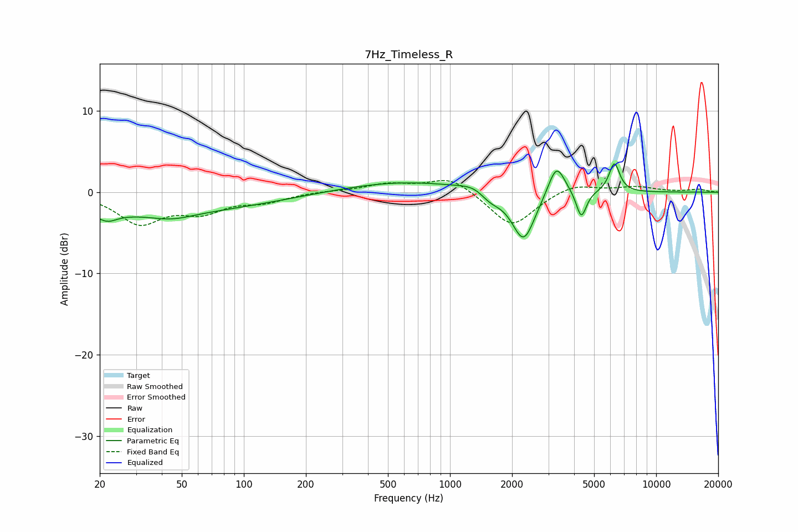

# 7Hz_Timeless_R
See [usage instructions](https://github.com/jaakkopasanen/AutoEq#usage) for more options and info.

### Parametric EQs
Apply preamp of -3.6 dB when using parametric equalizer.

|   # | Type    |   Fc (Hz) |    Q |   Gain (dB) |
|-----|---------|-----------|------|-------------|
|   1 | Peaking |        22 | 3.11 |        -1   |
|   2 | Peaking |        30 | 0.2  |        -2.5 |
|   3 | Peaking |        45 | 1.36 |        -0.8 |
|   4 | Peaking |       592 | 0.47 |         1.3 |
|   5 | Peaking |      1338 | 2.05 |         0.9 |
|   6 | Peaking |      1557 | 2.59 |        -1.3 |
|   7 | Peaking |      2276 | 2.5  |        -6.2 |
|   8 | Peaking |      3285 | 3.45 |         4   |
|   9 | Peaking |      4336 | 5.74 |        -3.4 |
|  10 | Peaking |      6272 | 5.34 |         3.6 |

### Fixed Band EQs
When using fixed band (also called graphic) equalizer, apply preamp of **-1.5 dB** (if available) and set gains manually with these parameters.

|   # | Type    |   Fc (Hz) |    Q |   Gain (dB) |
|-----|---------|-----------|------|-------------|
|   1 | Peaking |        31 | 1.41 |        -3.7 |
|   2 | Peaking |        62 | 1.41 |        -2.1 |
|   3 | Peaking |       125 | 1.41 |        -1   |
|   4 | Peaking |       250 | 1.41 |         0.1 |
|   5 | Peaking |       500 | 1.41 |         1   |
|   6 | Peaking |      1000 | 1.41 |         1.9 |
|   7 | Peaking |      2000 | 1.41 |        -4.3 |
|   8 | Peaking |      4000 | 1.41 |         1.1 |
|   9 | Peaking |      8000 | 1.41 |         0.6 |
|  10 | Peaking |     16000 | 1.41 |         0.3 |

### Graphs

