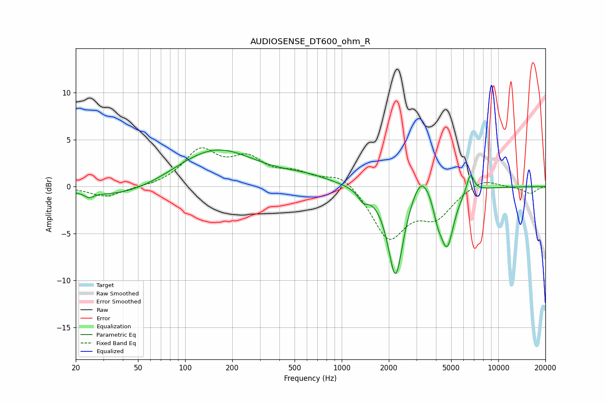

# AUDIOSENSE_DT600_ohm_R
See [usage instructions](https://github.com/jaakkopasanen/AutoEq#usage) for more options and info.

### Parametric EQs
Apply preamp of -4.0 dB when using parametric equalizer.

|   # | Type    |   Fc (Hz) |    Q |   Gain (dB) |
|-----|---------|-----------|------|-------------|
|   1 | Peaking |        24 | 5.29 |        -0.5 |
|   2 | Peaking |        41 | 0.53 |        -1.4 |
|   3 | Peaking |       155 | 0.55 |         4.1 |
|   4 | Peaking |       602 | 0.89 |         0.8 |
|   5 | Peaking |      1371 | 4.56 |        -1   |
|   6 | Peaking |      2207 | 2.87 |        -9.7 |
|   7 | Peaking |      3227 | 2.37 |         2.7 |
|   8 | Peaking |      4101 | 5.02 |        -1.7 |
|   9 | Peaking |      4707 | 3.23 |        -6.1 |
|  10 | Peaking |      6632 | 5.89 |         2.1 |

### Fixed Band EQs
When using fixed band (also called graphic) equalizer, apply preamp of **-4.2 dB** (if available) and set gains manually with these parameters.

|   # | Type    |   Fc (Hz) |    Q |   Gain (dB) |
|-----|---------|-----------|------|-------------|
|   1 | Peaking |        31 | 1.41 |        -1.1 |
|   2 | Peaking |        62 | 1.41 |        -0.1 |
|   3 | Peaking |       125 | 1.41 |         3.6 |
|   4 | Peaking |       250 | 1.41 |         2.6 |
|   5 | Peaking |       500 | 1.41 |         1.2 |
|   6 | Peaking |      1000 | 1.41 |         1.5 |
|   7 | Peaking |      2000 | 1.41 |        -5.5 |
|   8 | Peaking |      4000 | 1.41 |        -2.9 |
|   9 | Peaking |      8000 | 1.41 |         1   |
|  10 | Peaking |     16000 | 1.41 |        -0.7 |

### Graphs

