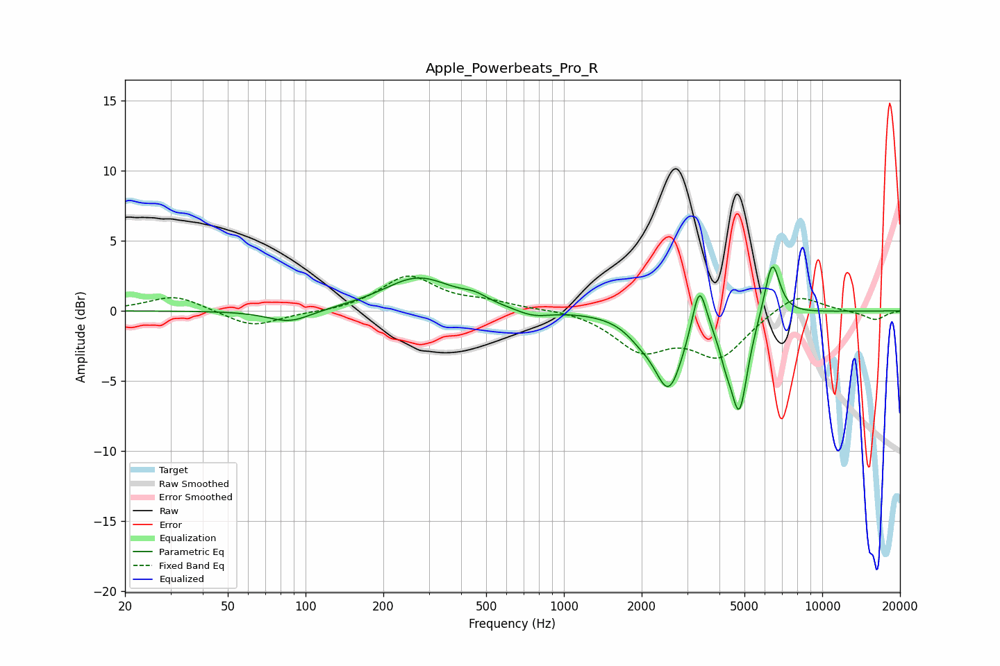

# Apple_Powerbeats_Pro_R
See [usage instructions](https://github.com/jaakkopasanen/AutoEq#usage) for more options and info.

### Parametric EQs
Apply preamp of -3.2 dB when using parametric equalizer.

|   # | Type    |   Fc (Hz) |    Q |   Gain (dB) |
|-----|---------|-----------|------|-------------|
|   1 | Peaking |        87 | 1.67 |        -0.9 |
|   2 | Peaking |       273 | 1.05 |         2.4 |
|   3 | Peaking |       452 | 2.89 |         0.5 |
|   4 | Peaking |       759 | 2.09 |        -0.5 |
|   5 | Peaking |      1972 | 2.5  |        -0.9 |
|   6 | Peaking |      2548 | 2.51 |        -5.3 |
|   7 | Peaking |      3344 | 5.18 |         3.7 |
|   8 | Peaking |      4226 | 5.53 |        -1.4 |
|   9 | Peaking |      4774 | 4.18 |        -6.8 |
|  10 | Peaking |      6400 | 4.6  |         4.1 |

### Fixed Band EQs
When using fixed band (also called graphic) equalizer, apply preamp of **-2.6 dB** (if available) and set gains manually with these parameters.

|   # | Type    |   Fc (Hz) |    Q |   Gain (dB) |
|-----|---------|-----------|------|-------------|
|   1 | Peaking |        31 | 1.41 |         1.1 |
|   2 | Peaking |        62 | 1.41 |        -1.2 |
|   3 | Peaking |       125 | 1.41 |        -0.1 |
|   4 | Peaking |       250 | 1.41 |         2.5 |
|   5 | Peaking |       500 | 1.41 |         0.5 |
|   6 | Peaking |      1000 | 1.41 |         0.2 |
|   7 | Peaking |      2000 | 1.41 |        -2.6 |
|   8 | Peaking |      4000 | 1.41 |        -3.1 |
|   9 | Peaking |      8000 | 1.41 |         1.4 |
|  10 | Peaking |     16000 | 1.41 |        -0.6 |

### Graphs

