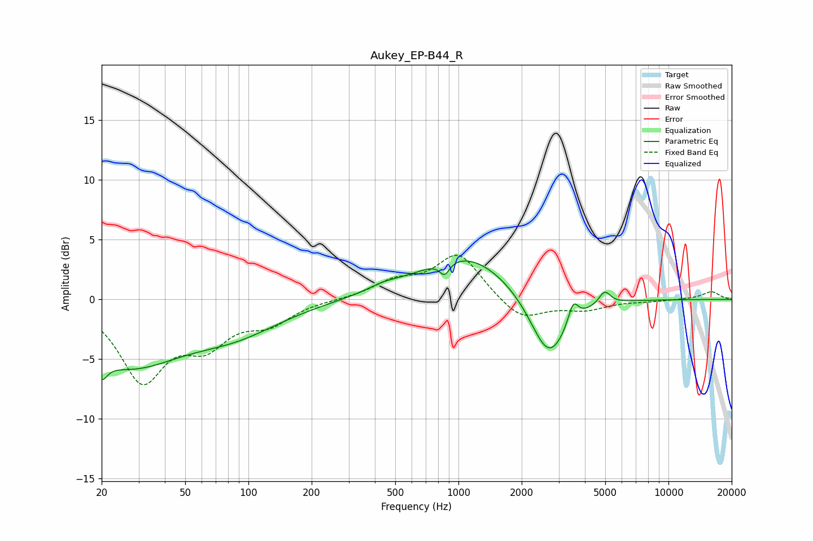

# Aukey_EP-B44_R
See [usage instructions](https://github.com/jaakkopasanen/AutoEq#usage) for more options and info.

### Parametric EQs
Apply preamp of -3.3 dB when using parametric equalizer.

|   # | Type    |   Fc (Hz) |    Q |   Gain (dB) |
|-----|---------|-----------|------|-------------|
|   1 | Peaking |        20 | 5.15 |         3.7 |
|   2 | Peaking |        20 | 5.21 |        -5.4 |
|   3 | Peaking |        26 | 0.55 |        -5.2 |
|   4 | Peaking |        88 | 0.64 |        -2.2 |
|   5 | Peaking |       439 | 1.78 |         0.5 |
|   6 | Peaking |       859 | 6    |        -1.1 |
|   7 | Peaking |      1087 | 0.65 |         3.8 |
|   8 | Peaking |      2697 | 1.59 |        -5.6 |
|   9 | Peaking |      3517 | 5.93 |         1.8 |
|  10 | Peaking |      4968 | 5.21 |         1.1 |

### Fixed Band EQs
When using fixed band (also called graphic) equalizer, apply preamp of **-3.8 dB** (if available) and set gains manually with these parameters.

|   # | Type    |   Fc (Hz) |    Q |   Gain (dB) |
|-----|---------|-----------|------|-------------|
|   1 | Peaking |        31 | 1.41 |        -6.5 |
|   2 | Peaking |        62 | 1.41 |        -3.2 |
|   3 | Peaking |       125 | 1.41 |        -1.7 |
|   4 | Peaking |       250 | 1.41 |        -0   |
|   5 | Peaking |       500 | 1.41 |         1.3 |
|   6 | Peaking |      1000 | 1.41 |         3.8 |
|   7 | Peaking |      2000 | 1.41 |        -1.8 |
|   8 | Peaking |      4000 | 1.41 |        -0.8 |
|   9 | Peaking |      8000 | 1.41 |        -0.1 |
|  10 | Peaking |     16000 | 1.41 |         0.7 |

### Graphs

